Manual
======

Theoretical and technical details of RD NMR are discussed in this document

**Goals**: Background on CPMG RD method, Details on GUARDD data
organization, features, and reference materials

Scientific questions addressed by RD NMR
----------------------------------------

-  **Question**: Is this molecule flexible in the μs-ms time window?

   -  If the R\ :sub:`ex` of an RD NMR experiment > 0, it will be flexible on this timescale

-  **Question**: If so, what is the nature of this exchange process?

   -  Typically, exchange processes are considered as at least
      one site of a single molecule which occupies at least two distinct
      local structures (AKA states or configurations), denoted A and B

-  **Question**: What is the chemical environment (e.g., structure) of
   this alternate configuration?

   -  The chemical shift difference Δω obtained from at least
      one RD NMR experiment informs on this question 

-  **Question**: On average, how often is this alternate configuration
   sampled?

   -  **Answer**: The total exchange rate k\ :sub:`ex` from at least one RD NMR
      experiment indicates the rate of interconversion between the A and B states 

-  **Question**: What is the relative population of this alternate
   configuration?

   -  **Answer**: via population P\ :sub:`A` from at least one RD NMR
      experiment

-  **Question**: How much activation energy is required to access this
   alternate configuration?

   -  **Answer**: via activation energies E(A→B) and E(B→A) from several
      RD experiments (Arrhenius analysis)

-  **Question**: What is the relative energy, enthalpy and entropy of this
   alternate configuration?

   -  **Answer**: via energy ΔG (via P\ :sub:`A`), enthalpy ΔH, entropy ΔS from
      several RD experiments (van’t Hoff analysis)

-  **Question**: Is the alternate configuration a well-defined fold? Is it
   unfolded?

   -  **Answer**: via chemical shift difference Δω, enthalpy ΔH, entropy
      ΔS from several RD experiments (See Kleckner & Foster, 2011

-  **Question**: Are motions in this molecule unified, coupled or
   independent?

   -  **Answer**: via exchange rates k\ :sub:`A` and k\ :sub:`B`, enthalpy ΔH,
      entropy ΔS and activation energies E(A→B) and E(B→A) for several
      sites from several RD experiments (See Kleckner & Foster, 2011)

Chemical exchange phenomenon 
----------------------------

**Adapted from Kleckner and Foster, 2011**

-  Certain dynamic processes in the μs-ms time window lead to
   characteristic broadening of the NMR signal
-  This “exchange broadening” can obscure the observables and in some
   cases render the NMR signal undetectable
-  However, this contains valuable information on the underlying dynamic
   process
-  The relaxation dispersion (RD) NMR experiment can access this
   information by use of a spin-echo pulse train

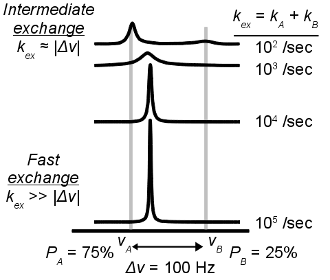

The RD experiment refocuses chemical exchange broadening R\ :sub:`ex`
---------------------------------------------------------------------

-  Carr-Purcell Meiboom-Gill Relaxation Dispersion (CPMG RD) uses
   spin-echo pulse trains to suppress relaxation due to exchange
   processes on the µs-ms timescale.
-  **(a)** The number of spin-echo pulses applied during the fixed
   relaxation time directly determines the CPMG frequency via ν\ :sub:`CPMG` = 1 / (4τ).

   -  The applied CPMG pulse train is shown above each relaxation delay
      (ν\ :sub:`CPMG` = 100, 500 and 1100 Hz).
   -  These pulses reduce the signal relaxation rate during the
      relaxation delay by refocusing exchange broadening (i.e., reducing
      R\ :sub:`ex`).

-  **(b)** The observed signal intensity remaining at the end of the TCPMG
   relaxation delay is used to obtain an effective relaxation rate, where I\ :sub:`0` is the signal intensity in the absence of the relaxation delay (i.e., when TCPMG = 0).
-  **(c)** The dispersion Curve reports on dynamics by plotting relaxation
   rate as a function of refocusing frequency.

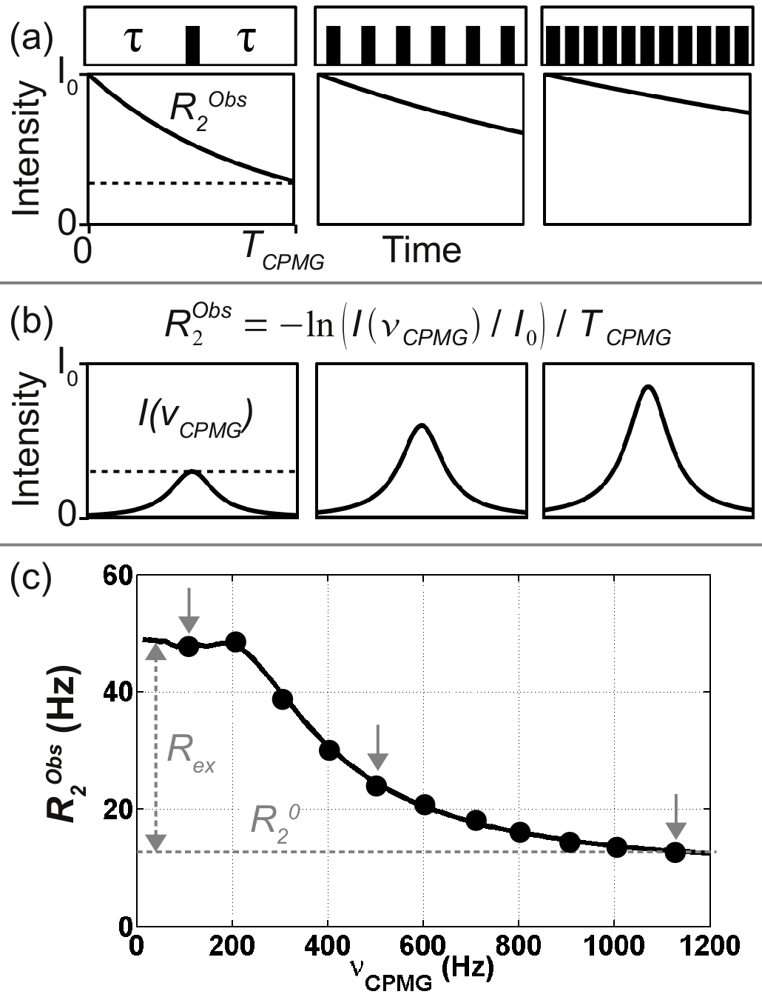

Two-state exchange model
------------------------

-  A single NMR probe (e.g., Ala 12N\ :sup:`H`) is considered to
   alternate between local structures designated A and B, which have
   distinct NMR chemical shifts in :sup:`1`\H and/or :sup:`A`\X dimensions. 
-  Although two signals are shown here, the “minor” B state is not detected
   directly because its NMR signal is too weak and/or too broad.
-  However, the A↔B exchange yields a quantitative effect on the measured RD Curve of signal A.

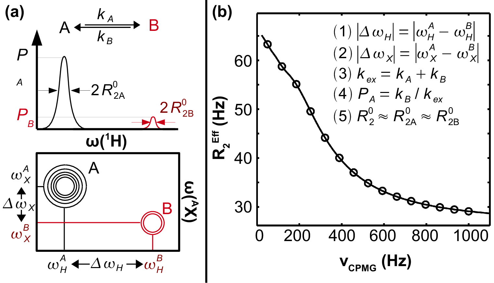

**The two-state exchange model requires 4-5 parameters to describe a
single RD Curve** 

**Structural parameters (1 or 2 per NMR probe)** 

-  \|(Δω\ :sub:`H`)\| (rad/s): Magnitude of :sup:`1`\ H chemical shift difference between A and B states (for MQ Curves only) 
-  \|(Δω\ :sub:`X`)\| (rad/s): Magnitude of :sup:`A`\ X chemical shift difference between A and B states (AX = :sup:`13`\ C or :sup:`15`\ N) 

**Kinetic parameters (2 per temperature per NMR probe)** 

**Parameters used in fitting equations**
 
-  k\ :sub:`ex` (/s): Total exchange rate between state A and B; k\ :sub:`ex` = k\ :sub:`A` + k\ :sub:`B`  
-  P\ :sub:`A` (-): Population fraction of state A; P\ :sub:`A` = k\ :sub:`B` / (k\ :sub:`A` + k\ :sub:`B`) with P\ :sub:`A` + P\ :sub:`B` = 1 \* Alternate physical parameterization, which requires knowledge of both k\ :sub:`ex` and P\ :sub:`A`
-  k\ :sub:`A` (/s): Average frequency (not velocity!) of transition from state A to state B 
-  k\ :sub:`B` (/s): Average frequency (not velocity!) of transition from state B to state A 

**Relaxation parameter (1 per Curve per NMR probe)**
 
-  R\ :sub:`2`\ :sup:`0` (Hz): Relaxation rate of the A state in the absence of exchange 
-  The MQ Curve shown here is simulated using \|ΔωH\| = 8 Hz, Abs(ΔωX) = 201 Hz, k\ :sub:`ex` = 1000 /s, P\ :sub:`A` = 90%,and = 10 Hz.

Assigning parameters for fitting
-------------------------------- 

Fitting requries five parameters per Curve, but often parameters can be shared when Curves are
aggregated into Curvesets, which are aggregated into Groups 

Details on Curves, Curvesets, and Groups can be found later in the Manual
s
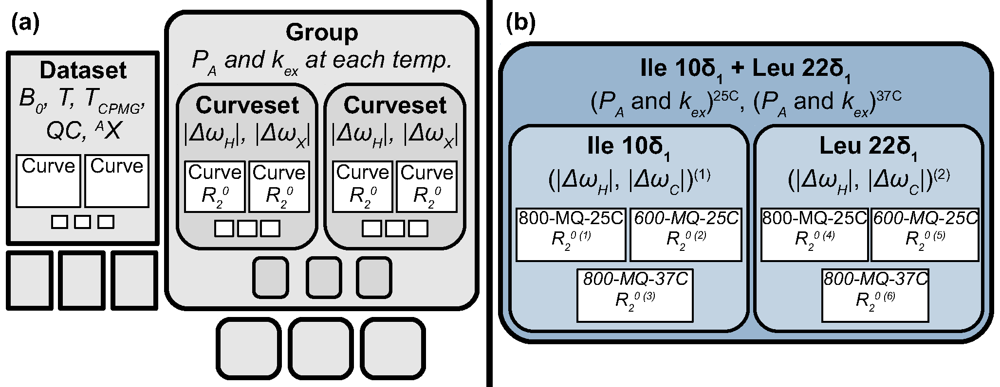

*Figure above* (a) Hierarchical data structures used in GUARDD, (b) example data structure

-  Each *Curve* is designated a unique R\ :sub:`2`\ :sup:`0`

   -  R\ :sub:`2`\ :sup:`0` = Transverse relaxation rate in the absence of
      exchange (Hz)

   -  **Assume**: Relaxation rates of states A and B are equal
      (R\ :sub:`2A`\ :sup:`0` = R\ :sub:`2B`\ :sup:`0`)

-  One or more Curves are aggregated into a *Curveset*, which designate
   the same chemical shift differences \|Δω\ :sub:`H`\| and \|Δω\ :sub:`X`\|

   -  **Assume**: \|Δω\ :sub:`H`\| (ppm) and \|Δω\ :sub:`X`\| (ppm) are independent
      of temperature

      -  Therefore, each unique temperature yields an independent
         measure of \|Δω\ :sub:`H`\| and/or \|Δω\ :sub:`X`\|

   -  **NMR**: Resonance frequency scales with magnetic field strength

      -  Therefore, each unique B\ :sub:`0` field yields an independent
         measure of \|Δω\ :sub:`X`\|

      -  See calculations for converting between rad/s and ppm later in the Manual

   -  **NMR**: An experiment may be designed to detect a particular
      quantum coherence

      -  Therefore, each unique quantum coherence yields an independent
         measure of \|Δω\ :sub:`H`\| and/or \|Δω\ :sub:`X`\|
      -  Single Quantum (SQ) experiments are sensitive to only
         \|Δω\ :sub:`H`\| or \|Δω\ :sub:`X`\|
      -  Multiple Quantum (MQ) experiments are sensitive to the sum
         \|Δω\ :sub:`H` + Δω\ :sub:`X`\|
      -  See Korzhnev, et al. (2005) 

         -  More information on Quantum Coherences in dispersion are covered later.

-  One or more Curvesets are aggregated into a *Group*, which designates
   the kinetic parameters (P\ :sub:`A` and k\ :sub:`ex` at each temperature)

   -  **Physics**: Kinetic parameters are determined by experimental
      conditions

      -  E.g., temperature, buffer, sometimes concentration but NOT
         magnetic field strength
      -  Therefore, each repeat condition (same or different B\ :sub:`0`)
         yields an independent measure of P\ :sub:`A` and k\ :sub:`ex`

   -  There are at least *two methods* to specify P\ :sub:`A` and k\ :sub:`ex` at
      each temperature
   -  Method A - No constraint on rate analysis

      -  Define P\ :sub:`A` and k\ :sub:`ex` at each temperature explicitly

   -  Method B - Constrain rate analysis via ΔH and E\ :sub:`AB`

      -  Define P\ :sub:`A` and k\ :sub:`ex` at a single temperature, T\ :sub:`0`
      -  Define ΔH for temperature-dependence of P\ :sub:`A` (vant Hoff)
      -  Define E\ :sub:`AB` for temperature-dependence of k\ :sub:`A` and, using
         ΔH, k\ :sub:`B` and therefore k\ :sub:`ex` = k\ :sub:`A` \+\ k\ :sub:`B` (Arrhenius)

   -  See calculations in the Arrhenius section of this Manual

Example parameter assignment
^^^^^^^^^^^^^^^^^^^^^^^^^^^^

Check the command window output for itemization of each parameter in a given Group

Usethe debugging output option 

::

   OUTPUT_DEBUG_UPDATE_FIT_PARAMS 

*Figure above* (a) Hierarchical data structures used in GUARDD, (b) example data structure discussed below*

-  **Goal**: Show two ways (A or B) to itemize temperature-depenence of
   P\ :sub:`A` and k\ :sub:`ex`
-  *Example: Method A - No constraint on rate analysis*

   -  Define P\ :sub:`A` and k\ :sub:`ex` at each temperature

-  *Notation*

   -  CS = Curveset number (1 or 2)
   -  C = Curve number within the Curveset (1, 2, or 3)
   -  CTOT = Total Curve number within the Group (1, 2, 3, 4, 5, or 6)

::

    FUNCTION: Group.updateFitParams
        Working on CS=1, Ile 10\delta_1
	Working on C=1 (CTOT=1), 800-MQ-25C
		Itemizing parameter 1 (dwH @ CS1, C1)
		Itemizing parameter 2 (dwX @ CS1, C1)
		Itemizing parameter 3 (PA @ 298K) *PA0*
		Itemizing parameter 4 (kex @ 298K) *kex0*
		Itemizing parameter 5 (R20 @ CS1, C1)
	Working on C=2 (CTOT=2), 600-MQ-25C
		Linking dwH to parameter 1, scaled by 0.750091x
		Linking dwX to parameter 2, scaled by 0.750091x
		Linking PA to parameter 3, scaled by 1.000000x
		Linking kex to parameter 4, scaled by 1.000000x
		Itemizing parameter 6 (R20 @ CS1, C2)
	Working on C=3 (CTOT=3), 800-MQ-37C
		Linking dwH to parameter 1, scaled by 1.000000x
		Linking dwX to parameter 2, scaled by 1.000000x
		Itemizing parameter 7 (PA @ 310K) *PA0*
		Itemizing parameter 8 (kex @ 310K) *kex0*
		Itemizing parameter 9 (R20 @ CS1, C3)
        Working on CS=2, Leu 22\delta_1
	Working on C=1 (CTOT=4), 800-MQ-25C
		Itemizing parameter 10 (dwH @ CS2, C1)
		Itemizing parameter 11 (dwX @ CS2, C1)
		Linking PA to parameter 3, scaled by 1.000000x
		Linking kex to parameter 4, scaled by 1.000000x
		Itemizing parameter 12 (R20 @ CS2, C1)
	Working on C=2 (CTOT=5), 600-MQ-25C
		Linking dwH to parameter 10, scaled by 0.750091x
		Linking dwX to parameter 11, scaled by 0.750091x
		Linking PA to parameter 3, scaled by 1.000000x
		Linking kex to parameter 4, scaled by 1.000000x
		Itemizing parameter 13 (R20 @ CS2, C2)
	Working on C=3 (CTOT=6), 800-MQ-37C
		Linking dwH to parameter 10, scaled by 1.000000x
		Linking dwX to parameter 11, scaled by 1.000000x
		Linking PA to parameter 7, scaled by 1.000000x
		Linking kex to parameter 8, scaled by 1.000000x
		Itemizing parameter 14 (R20 @ CS2, C3)

-  *Example: Method B - Constrain rate analysis via ΔH and E\ :sub:`AB`\*

   -  Define P\ :sub:`A` and k\ :sub:`ex` at a single temperature, T\ :sub:`0`
   -  Define ΔH for temperature-dependence of P\ :sub:`A` (vant Hoff)
   -  Define E\ :sub:`AB` for temperature-dependence of k\ :sub:`A` and, using ΔH,
      k\ :sub:`B` and therefore k\ :sub:`ex` = k\ :sub:`A` \+\ k\ :sub:`B` (Arrhenius)
   -  *Note*: this uses ΔH and E\ :sub:`AB` instead of P\ :sub:`A`\(37C) and
      k\ :sub:`ex`\(37C)

::

   FUNCTION: Group.updateFitParams
		Number of temperatures 2 > 1
		Itemizing parameter 1 (dH)
		Itemizing parameter 2 (Eab)
        Working on CS=1, Ile 10\delta_1
	Working on C=1 (CTOT=1), 800-MQ-25C
		Itemizing parameter 3 (dwH @ CS1, C1)
		Itemizing parameter 4 (dwX @ CS1, C1)
		Itemizing parameter 5 (PA @ 298K) *PA0*
		Itemizing parameter 6 (kex @ 298K) *kex0*
		Itemizing parameter 7 (R20 @ CS1, C1)
	Working on C=2 (CTOT=2), 600-MQ-25C
		Linking dwH to parameter 3, scaled by 0.750091x
		Linking dwX to parameter 4, scaled by 0.750091x
		Linking PA to parameter 5, scaled by 1.000000x
		Linking kex to parameter 6, scaled by 1.000000x
		Itemizing parameter 8 (R20 @ CS1, C2)
	Working on C=3 (CTOT=3), 800-MQ-37C
		Linking dwH to parameter 3, scaled by 1.000000x
		Linking dwX to parameter 4, scaled by 1.000000x
		Linking PA @ 310K to PA0 @ T0=298K (param 5) via Temp (310K), dH (param 1), and Eab (param 2)
		Linking kex @ 310K to kex0 @ T0=298K (param 6) via Temp (310K), dH (param 1), and Eab (param 2)
		Itemizing parameter 9 (R20 @ CS1, C3)
        Working on CS=2, Leu 22\delta_1
	Working on C=1 (CTOT=4), 800-MQ-25C
		Itemizing parameter 10 (dwH @ CS2, C1)
		Itemizing parameter 11 (dwX @ CS2, C1)
		Linking PA to parameter 5, scaled by 1.000000x
		Linking kex to parameter 6, scaled by 1.000000x
		Itemizing parameter 12 (R20 @ CS2, C1)
	Working on C=2 (CTOT=5), 600-MQ-25C
		Linking dwH to parameter 10, scaled by 0.750091x
		Linking dwX to parameter 11, scaled by 0.750091x
		Linking PA to parameter 5, scaled by 1.000000x
		Linking kex to parameter 6, scaled by 1.000000x
		Itemizing parameter 13 (R20 @ CS2, C2)
	Working on C=3 (CTOT=6), 800-MQ-37C
		Linking dwH to parameter 10, scaled by 1.000000x
		Linking dwX to parameter 11, scaled by 1.000000x
		Linking PA to parameter 5, scaled by 1.000000x
		Linking kex to parameter 6, scaled by 1.000000x
		Itemizing parameter 14 (R20 @ CS2, C3)

Organizing data
---------------

**Goal**: Organize data in hierarchical manner to provide framework for fitting procedures

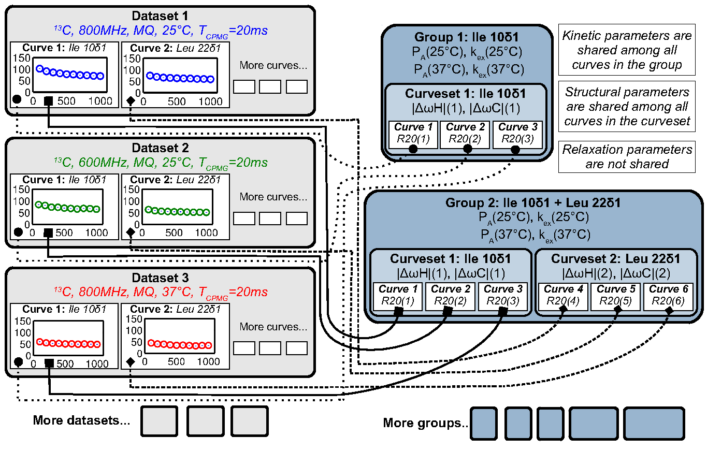

*Figure above* Datasets contain Curves, which are linked to by Curvesets within Groups

Dataset
^^^^^^^

**Goal**: *Store a CPMG NMR dataset and the experimental conditions during acquisition*

-  Properties

   -  **name**: Name of dataset (e.g., ‘MQ 800MHz 25C’)
   -  **AX_String**: *13\ C or 15\ N*
   -  **B\ :sub:`0`\**: Magnetic field strength (1\ H MHz)
   -  **Temp**: Temperature (K)
   -  **TCPMG**: Total CPMG time in pulse sequence
   -  **SQX**: True=Single Quantum dataset (Δω\ :sub:`H` fixed to zero),
      False=Multiple Quantum dataset (Δω\ :sub:`H` may be non-zero)

-  Data for each dispersion Curve

   -  Intensity values and errors
   -  R\ :sub:`2eff` values and errors
   -  ν\ :sub:`CPMG` values
   -  Pointers to Curves which also hold this information

**Key functions in code**

::

   Dataset.m

-  Add a single RD curve to the dataset

::

   addData

::

   calculateR2eff

::

   calculateErrorsUsingDuplicates

::

   enforceMinimumError

::

   readNlin

Curve 
^^^^^

**Goal**: Store an NMR dispersion Curve (R\ :sub:`2`\Eff (ν\ :sub:`CPMG`\)) and the experimental conditions during acquisition, which correspond to its parent.

-  Properties

   -  **name**: Name of the Curve (e.g., ’Leu 12:raw-latex:`\delta`\ *2’)
   -  **index**: *Residue number*
   -  **atom**: Name of atom (N, H:raw-latex:`\alpha`, C:raw-latex:`\delta`\ *1, etc.)
   -  **residue**: Name of residue (Ile, Leu, Arg, etc.)

-  Properties from its parent Dataset (copied to each
   Curve for convenience)

   -  **AX_String**: 13\ C or 15\ N
   -  **\B\ :sub:`0`\**: Magnetic field strength (1\ H MHz)
   -  **Temp**: Temperature (K)
   -  **TCPMG**: Total CPMG time in pulse sequence
   -  **SQX**: True=Single Quantum dataset (Δω\ :sub:`H` fixed to zero), False=Multiple Quantum dataset (Δω\ :sub:`H` may be non-zero)

-  Data from its parent Dataset (copied to each Curve
   for convenieice)

   -  **Nobs**: Number of observations
   -  **vcpmg**: Array of vcpmg values (Hz)
   -  **R2eff**: Array of R2eff values (Hz)
   -  **eR2eff**: Array of errors in R2eff (Hz)

-  Each Curve is unique, but can have multiple *appearances*, each of
   which points to the same source data

   -  Multiple appearances can occur in different Curvesets
   -  Any changes to a Curve will alter every apperance of that Curve
      (e.g., in all Curvesets that point to it)

**Key functions in code:**

::

   Curve.m

-  Basic input/output

Curveset
^^^^^^^^

**Goal**: Store a set of Curves (each from the same NMR probe/assignment) which all share a single pair of chemical shift differences (Δω\ :sub:`H` and Δω\ :sub:`X`)

-  Properties

   -  *name*: *Name of Curveset*
   -  *index*: *Residue number*
   -  *atom*: \_Name of atom (N, H:raw-latex:`\alpha`,
      C:raw-latex:`\delta`\ *1, etc.)*
   -  *residue*: *Name of residue (Ile, Leu, Arg, etc.)*

-  Curvesets contain *pointers* to Curves (selected from Datasets)

   -  *Nc*: *Number of Curves in the Curveset*
   -  Pointers to [Manual#Curve Curves] which hold the actual data and
      experimental conditions

-  Each Curveset only appears *once* (unlike Curves)

**Key functions in code:** 

::

   Curveset.m

-  Basic input/output

Group
^^^^^

**Goal**: Store a Group of Curvesets (each from different NMR probes/assignments) which all share a single set of exchange kinetics (P\ :sub:`A` and k\ :sub:`ex` at each temperature), and store any Fit Results for this Group

-  Properties

   -  **name**: Name of Group
   -  **index**: Index of the Group (for sorting; this may correspond to
      residue number)

-  Storage of fitting results

   -  **exhibitsExchange**: This Group exhibits exchange (true/false)
   -  **bestFitIsOK**: The best fit to this Group is OK (true/false)
   -  **Nf**: Number of fit results
   -  **fitResults_Grid**: Array of FitResults for the grid search
   -  **fitResults**: Array of FitResults for arbitrary fits (ex and
      no-ex)
   -  **fitResult_NoEx**: Fit result to no exchange model
   -  **fitResult_Best**: Best fit result out of all fits (ex and no-ex)

-  Groups contain *pointers* to Curvesets, each of
   which only appears once
-  Each Group points to a parent Session which contains
   settings, etc.

**Key functions in code:** 

::

   Group.m

-  De-linearize parameter array to matrix form for fitting

::

   delinearizePFmincon

-  Return data point (NATURAL UNITS) for the desired parameter, temperature, B\ :sub:`0`\, and Quantum Coherence

:: 

   getData

-  Perform grid search to fit RD data with variety of initial conditions, and return updated fit_results

::

   gridSearch

-  Identify the independent parameters and dependent scaling factors for the Group fit

::

   updateFitParams

Fit Result
^^^^^^^^^^

**Goal**: Pefrorm a single fit to a Group of RD data, and store the results

-  Storage of a single fit result

   -  Name of fit result
   -  Use of Arrhenius relation to constrain rate analysis
   -  Initial conditions for fit parameters
   -  Final values for fit parameters
   -  Errors in fit parameters (from Monte Carlo)
   -  Designation if each parameter is OK or not
   -  RateAnalysis structure for temperature-dependence

**Key functions in code:** 

::  

   FitResult.m

-  Analyze the fitResult (usually called after fitMe()

::

   analyzeMe
-  Estimate error in dispersion fit using Monte Carlo bootstrapping

::

   calculateErrors

-  Fit the Group either to NOEXCHANGE or EXCHANGE model

::

   fitMe
-  Set the param_isOK for the parameter name

::

   setParamIsOK
-  Simulate the fit (no optimization)

::

   simMe

-  Set initial fitting conditions

::

   setInitial_Kinetics_UnconstrainedRates

-  Set initial fitting conditions

::

   setInitial_Kinetics_ConstrainedRates

-  Set initial fitting conditions for Δω\ :sub:`H`\, Δω\ :sub:`X`\, and R20

::

   setInitial_Shifts

Rate Analysis
^^^^^^^^^^^^^

**Goal**: Store the results of a temperature-dependent analysis of the P\ :sub:`A` and k\ :sub:`ex`

-  Storage of temperature-dependent parameters

   -  All Arrhenius parameters
   -  arrhenius_isOK
   -  All vant Hoff parameters
   -  vantHoff_isOK

**Key functions in code:** 

::

   RateAnalyis.m

-  Update kinetic quantities using P\ :sub:`A`\(T) and k\ :sub:`ex`\(T)

::

   analyzeMe

-  Return X and Y vectors for the Arrhenius plots A (ln(kA) vs. 1/T (or ln(kB) vs 1/T))

::

   getArrheniusPlotA

-  Return X and Y vectors for van’t Hoff plot (ln(K) vs 1/T)

::

   getVantHoffPlot

Session
^^^^^^^

**Goal**: Store the program data and settings

-  Store all Datasets
-  Store all Groups

**Key functions in code:** 

::

   FitResult.m

-  Generate minimal set of NEW Groups to partition Curves via NMR probe (index/atom)

::

   generateGroups

-  Generate minimal set of NEW Curvesets to partition Curves via NMR probe (index/atom)

::

   generateCurvesetsForGroup

-  Return plot title and axis label for a given parameter name

::

   getPlotLabels

-  Return plot symbol character (‘o’, ‘s’, etc.) and colorRGB vector

::

   getPlotSymbolAndColor

-  Load 1+ datasets using script file

::

   loadDatasets

-  Sort the Groups by index and name

::

   sortGroups

-  Convert the parameter units for arbitrary parameter for natural or display units

::

   convertUnits

-  Does the parameter need a particular Temp and/or B\ :sub:`0`\?

::

   getParamRequirements

General Use
-----------

Acquire and prepare data
^^^^^^^^^^^^^^^^^^^^^^^^
**Acquire CPMG RD NMR spectra**

-  Multiple temperatures, B\ :sub:`0` fields, SQ and/or MQ dispersion for either :sup:`13`\ C or :sup:`15`\ N sites 

-  Extract peak intensities with NMRPipe_. 

.. _NMRPipe: http://guardd.googlecode.com/files/Processing-RD–2008.07.07.zip

Analyze data using GUARDD
^^^^^^^^^^^^^^^^^^^^^^^^^

-  Load the data and execute the grid search on exchanging Groups 
-  For each Group, the grid search fit is selected, otherwise an individual fit is performed
-  In YES to exchange, the current best fit is evaluated via χ\ :sup:`2` maps and rate analyses 
-  If NO exchange, the *NoEx* fit is marked for subsequent analysis 
-  If fitted values can be optimized, the user supplies new initial conditions and re-evaluates the fit at (3)
-  If fitted values cannot be optimized, the user designates which ones are valid/invalid, if any 

   -  It is important that invalid parameters be designated as such, lest they be analyzed/displayed in subsequent output

-  The user should enter text to describe the fitting result

   -  Especially if there is work to do (e.g., new Grid Search, multi-Curveset fitting, remove noisy data)
 
-  Once fits are optimized, errors are calculated using Monte Carlo bootstrapping and results are viewed 

   -  New Groups can be generated to test global motions and/or to refine fit results

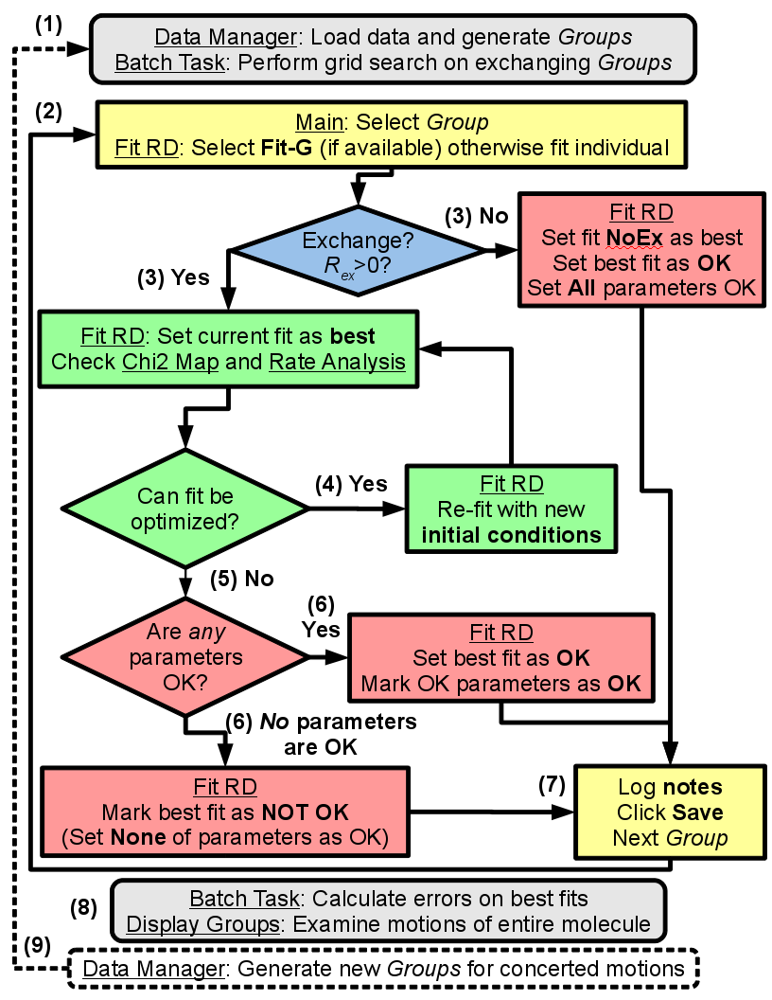

GUARDD Graphical Interface
--------------------------

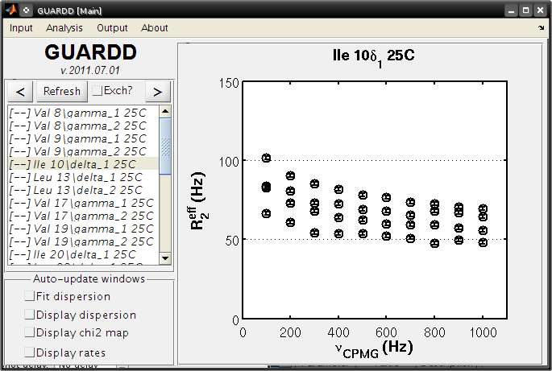

GUARDD Input menu
^^^^^^^^^^^^^^^^^

Clear session
#############

Clears the session, as if the program was
just opened

Load session
############

-  Clears the current session 
-  Loads a previously saved GUARDD session (a “.mat” MATLAB variables file) 

   -  This may take a relatively long time to load 
   -  1 Mb file takes ~0.5 min 
   -  10 Mb file takes ~5 min 

Settings
########

**Goal**: Change program settings here

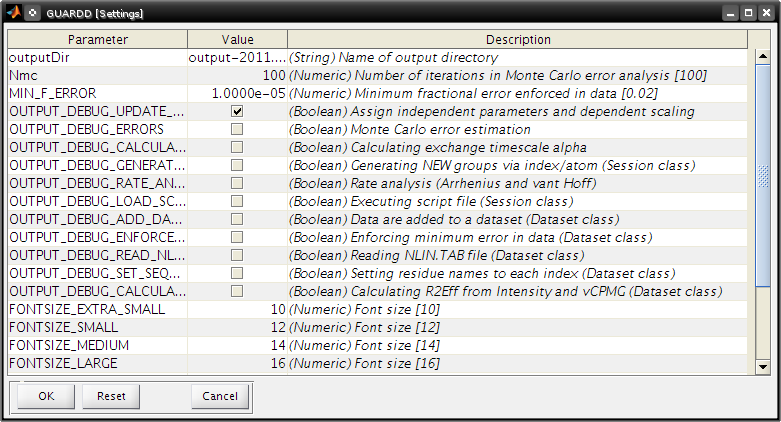

-  Take special note of OUTPUT_DEBUG flags, which are helpful to see
   program logic during execution
-  The items on this list are set in the code via
   {{{Session.param_info}}}

Data Manger
###########

**Goal**: *Manage datasets, Curves, Curvesets, and Groups for analysis (input and basic output)*

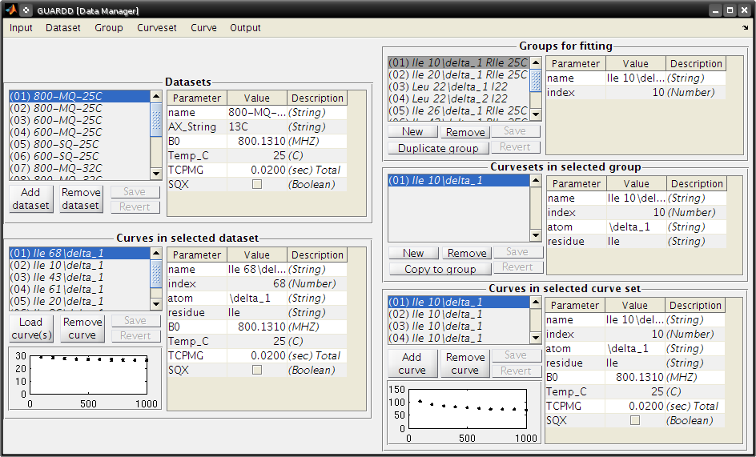

**Menu items** 

-  Input…
-  Script… 

  -  Loads a script file

- Sequence file…

  -  Load a sequence file 
 
-  Dataset…
   
   -  *Sort Curves (this dataset)* → Curves sorted by {{{index}}} and {{{atom}}} are easier to browse 
   -  *Sort Curves (all datasets)* 

-  Group…

   -  Sort Groups → Groups sorted by *index* and *name* are easier to browse 

      - Code:
      
      ::

           Session.sortGroups() 

   -  Generate from all data → Generate minimal set of NEW Groups to partition Curves via NMR probe (index and atom)
  
      -  Each new Group contains one new Curveset containing all the Curves for that NMR probe 

      -  Code:

      ::

           Session.generateGroups()

   -  Generate from subsets of data →  Same as above, except using Curves from only part of the dataset 

      -  This launches the Create Groups dialog
      -  Code: 

      ::
         
         Session.generateGroups()

-  Curveset… 

   -  Sort Curvesets (this Group)… → Curvesets sorted by index and name are easier to browse 

   -  Generate from alldata… → For the selected Group, generate minimal set of NEW Curvesetsto partition Curves via NMR probe (index and atom) 

      -  This is the easiest way to generate a large Group (e.g., all Curves reporting same dynamic process) 

      -  From here, certain Curvesets and Curves can be removed, if desired 

   -  Copy to Group… → Copy the selected Curveset to another Group 

      -  This launches the Select Group dialog

-  Curve… 

   -  (Nothing yet) 

-  Output… 
-  Datasets…  

   -  Writes a Dataset file 

 - Groups…

   -  Writes a Groups file

**Panels and buttons** 

-  Each table contains editable information on the object 

-  *Button: Save* → Save changes made to the table
-  *Button: Revert* → Discard changes made to the table 
-  *Panel: Datasets* 

   -  Displays all the loaded datasets
   -  *Button: Add dataset* → Adds an empty Dataset to the list
 
      -  This can be edited and Curves can be loaded manually using nlin.tab file 
      -  This is NOT the preferred method to load data 

   -  *Button: Remove dataset* → Removes the selected dataset from the list

-  *Panel: Curves in selected dataset* 

   -  Lists all the Curves and displays their properties 

   -  **Note**: Changing Curve properties here will propagate to all apperances of that Curve 

   -  *Button: Load Curve(s)* → This is NOT the preferred method to load data
 
   -  *Button: Remove Curve* → Removes the selected Curve from the Dataset (and ALL appearances of that Curve) 

-  *Panel: Groups for fitting* 

   -  Lists all the Groups in the Session 
   -  *Button: New* → Add an empty Group 

      -  Useful for creating custom Groups with desired Curvesets and Curves 

   -  *Button: Remove* → Remove the selected Group 
   -  *Duplicate Group* → Copy the Group and all Curvesets within 

      -  Useful for creating custom Groups (e.g., copy then add/remove Curvesets) 

-  *Panel: Curvesets in selected Group* 

   -  Displays all the Curvesets in the selected Group 
   -  *Button: New* → Add an empty Curveset to the selected Group 
   -  *Button: Remove* → Remove the selected Curveset from the selected Group 
   -  *Button: Copy to Group* → Copy the selected Curveset to another Group 

      -   This launches the Select Group dialog 

-  *Panel: Curves in selected Curveset* 

   -  Displays all the Curves which are pointed to by the selected Curveset
   -  **Note**: Changing Curve properties here will propagate to all apperances of that Curve 
   -  *Button: Add Curve* → Add the Curve that is selected from the Dataset (on the left) 
   -  *Button: Remove Curve* → Remove the appearance of this Curve from the Curveset (does NOT delete Curve from the dataset)

Create Groups
#############

**Goal**: Create a set of Groups using a subset of the data

Helpful when only part of a large dataset is desired

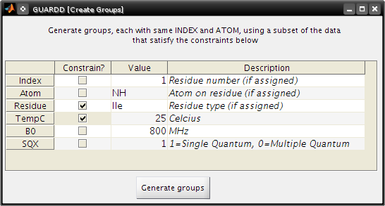

-  Tutorial: Advanced Group creation

Select Group
############

**Goal**: Select a Group so that the selected
Curveset can be copied to it

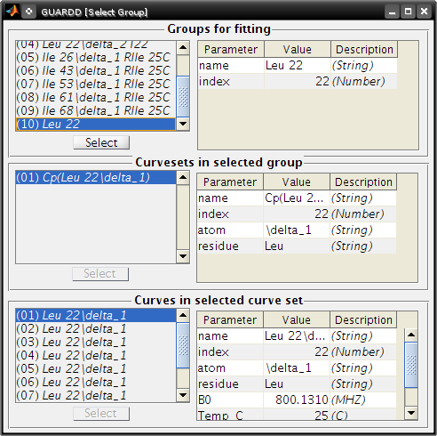

-  Tutorial: Advanced Group creation

Tutorial Tasks
############## 
-  Tutorial: Load data
-  Tutorial: Basic Group creation  
-  Tutorial: Advanced Groupcreation (copy) 

RD Simulator
############

**Goal**: Explore the nature of RD pheneomnea and create simulated Group data for planning experiments and edification

-  Tutorial: Data simulation
 
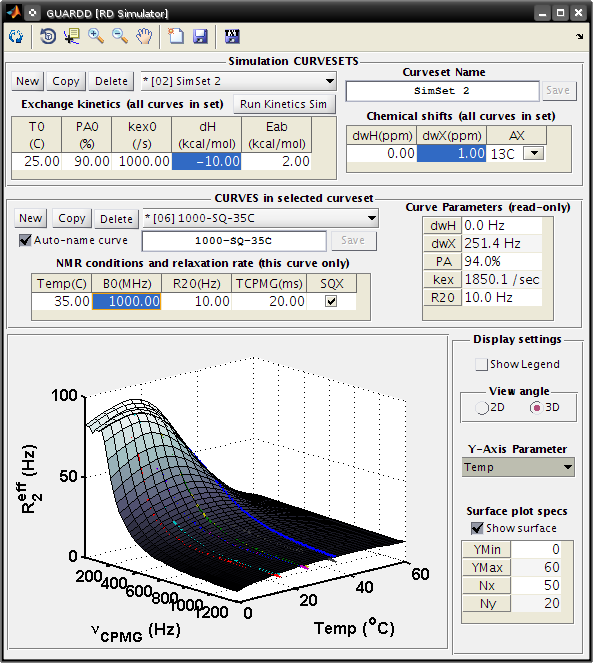

**Key sections of code**

::

   SimulationCurve.m

-  holds a single curve for GUARDD simulation

::  
 
   SimulationCurveset.m

-  holds a single curveset for a GUARDD simulation

::

   SimulationSession.m

-  holds information for all simulations in GUARDD

Kinetic Simulator
#################

**Goal**: Explore the nature of two-state exchange phenomenea for planning experiments and edification

-  Tutorial: Kinetic simulation
-  See related: Kinetic simulation equations are covered later in this Manual

GUARDD Analysis menu
^^^^^^^^^^^^^^^^^^^^

Fit Dispersion
############## 

**Goal**: Implement fits to Group, view results, log notes, and designate parameter validity 

-  The “product” is a best fitResult, and its parameters which are OK (those are used/displayed in subsequent analyses)
-  **Note**: Tasks completed in this window are automatically committed (no need for an “OK” or “Save” command)

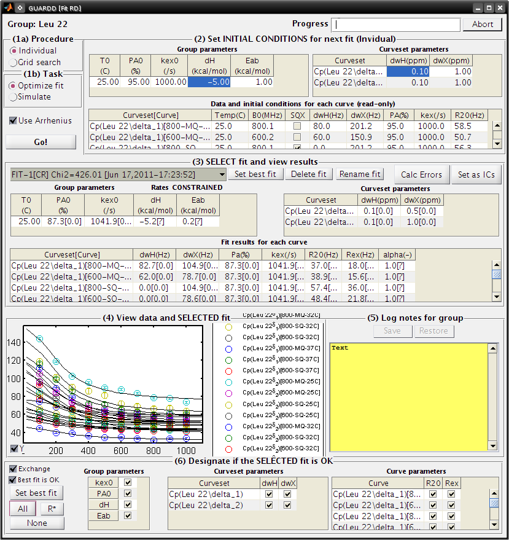

-  This window contains six panels for fitting tasks
-  Panel: (1a) Procedure

   -  Individual → Specify one set of initial conditions for one
      simulation or optimization
   -  Grid search → Specify a range of initial conditions for many simulations or optimizations

-  *Panel: (1b) Task*

   -  Optimize fit → Starting at the initial conditions, iteratively
      alter parameter to minimize the χ\ :sup:`2` for the Group, read
      [Manual#Fitting_data here]
   -  Simulate → Simulate the initial conditions for the fit

      -  Useful for seeing what the initial conditions look like

-  *Checkbox*: Use Arrhenius → Use Arrhenius relation with ΔH and E\ :sub:`AB` for temperature-dependence of k\ :sub:`ex` and P\ :sub:`A`
-  *Button*: Go! → Initiate task

-  *Panel: (2) Set INITIAL CONDITIONS*

   -  Note: The initial value of R\ :sub:`2`\ :sup:`0` for each Curve is set
      to Min(\ :sub:`2`\ :sup:`Eff`) for that Curve
   -  This panel operates in (Individual) or (Grid Search) mode,
      determined by Panel (1a)
   -  *(Individual)*

      -  *Table: Group parameters* → The kinetic parameters apply to the
         entire Group
      -  *Table: Curveset parameter* → The structural parameter apply to
         each Curveset
      -  *Table: Data and initial conditions for each Curve (read-only)*
         → Summary of dataset and its initial fit conditions

   -  *Grid Search*

      -  *Table: Grid search* → Limits of each dimension in grid search
         
-  *Panel: (3) SELECT fit and view results*

   -  *List* → Select one of the available fits

      -  The fit name is automatically generated from 5 features 

      -  FIT vs SIM: Designates whether the fitResult is for
         an optimization (FIT) or simulation (SIM) 

      -  -1 vs -G: Designates whether the fitResult is from an individual fit (-1) or from a grid search (-G) 
      -  [–] vs [CR]: Designates whether the Arrhenius “constrain rates” option is off (–) or on (CR) 
      -  Chi2=###: Designates the value of χ\ :sup:`2` for the Group (lower value is better fit)
      -  [Date-Time]: Designates the date and time at which the fitResult was created

   -  *Button: Set best fit* → Designate the current fit as the best
      one, which is displayed in all appearances of Group parameters
   -  *Button: Delete fit* → Remove the selected fit from the list
   -  *Button: Rename fit* → Rename the currently selected fit

      -  Useful for when certain constraints are used, or if it is selected from a grid

   -  *Button: Calc Errors* → Initiate Monte Carlo error analysis on the Group 
   -  *Button: Set as ICs* → Set the current fitResult as the initial conditions for the next fit

      -  Useful for altering fit conditions during user-directed optimization

-  *Panel: (4) View data and SELECTED fit*

   -  (Self explanatory)

-  *Panel: (5) Log notes for Group*

   -  These can be displayed in the Notes window 
   -  These can be exported in the Results Table window

-  *Panel: (6) Designate if SELECTED fit is OK*

   -  To display/analyze a given best fit parameter, the best fit must
      be OK AND the particular parameter must be OK
   -  *Checkbox: Exchange*: The Group exhibits exchange (true/false)
   -  *Checkbox: Best fit is OK*: The Group fit is OK, which is required
      for subsequent display of fit results (true/false)
   -  *Button: Set best fit* → Designate the current fit as the best
      one, which is displayed in all appearances of Group parameters
   -  *Button: All* → Mark all the parameters as OK
   -  *Button: R* → Make only R20 and Rex as OK
   -  *Button: None* → Mark all of the parameters as NOT OK

-  Tutorial: Basic fitting 
-  Tutorial: Multi-temperature fitting
-  Tutorial: Multi-temperature + multi-Curveset fitting
-  See related: fitting equations
-  See related: minimizing χ\ :sup:`2`

Batch Task
##########
 
**Goal**: *Queue up lengthy computations for
sequential processing*

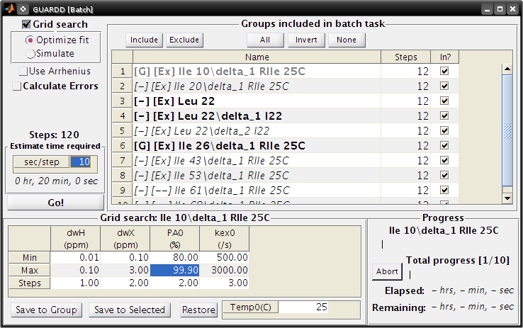

-  Tutorial: set up a batch task 

Notes
#####
**Goal**: *Document notes on Session, and read notes on all Groups*

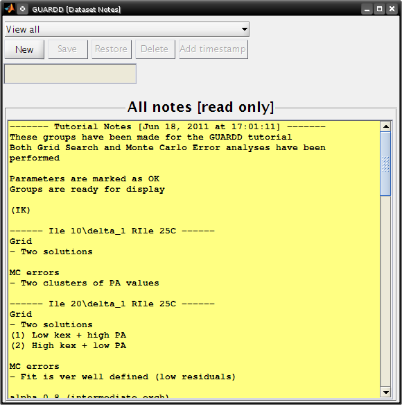

-  Group notes can be modified in the Fit RD window
-  Group notes can be read and exported to plain-text in the Results Table
-  Tutorial: View notes for organization

Debug
#####

-  Runs the code in the function GUARDD.m/menu_run_code_Callback(), used for debugging 
-  Helpful for debugging features of GUARDD

GUARDD Output menu
^^^^^^^^^^^^^^^^^^

Save session
############

**Goal**: Write the session to MATLAB file to save data and program state 

Display Dispersion
##################

**Goal**: Display RD Curves in a Group to assess fit quality (via residuals) and prepare figures for dissemination

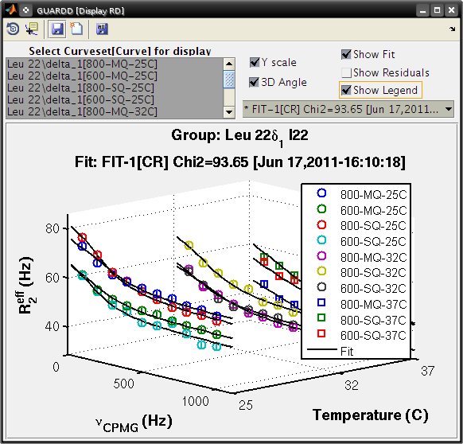

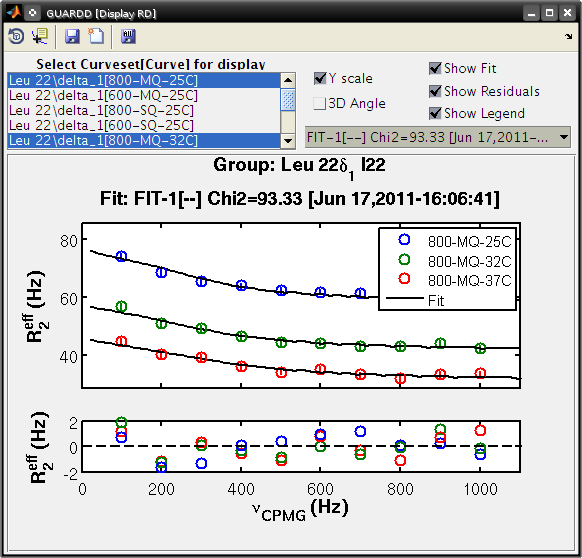

-  Tutorial: display the dispersion 

Display Chi2 Map
################

**Goal**: Browse the results of a grid
search or MC error analysis to assess and refine fit

-  Key info on features of chi2 maps

   -  The χ\ :sup:`2` map is a hypersurface with amplitude χ\ :sup:`2`
      and one dimension for each independent fitting parameter

      -  E.g., 14 parameters yields a 14D hypersurface

   -  Lower value of χ\ :sup:`2` indicates a more precise fit to the
      data
   -  The goal is to obtain paramters at the *global* minimum of
      χ\ :sup:`2`
   -  Issue: the nonlinear nature of RD yields a “rough” χ\ :sup:`2` map
      that can trap the fitting routine in local minima

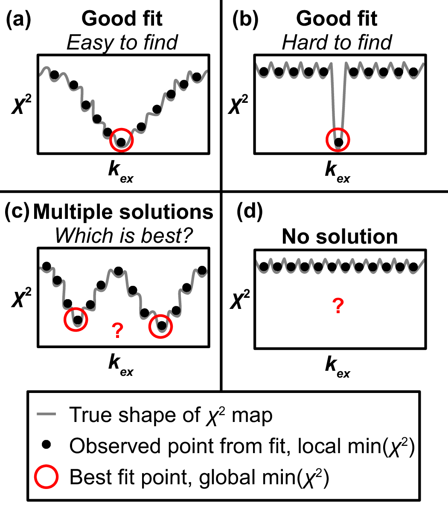

*Figure above* The response of χ\ 2 to just one parameter k\ :sub:`ex`
produces a 2D slice through the hypersurface to illustrate four commonly
encountered shapes that pose distinct challenges in obtaining an
accurate fit.

**Goal**: Interpret the Grid Search results the Chi2 Map window

-  Each subplot shows a single parameter on the X-axis, and its
   different values in different fits 
-  Each *black point* corresponds
   to ONE optimized fit result 
-  There are 60 fits in this example
   (hence 60 points in each subplot), each of which started from a different location in parameter space 
-  Those initial locations can be displayed by setting *Results to display*: Initial 
-  The *red circle* designates the currently selected fit result 
-  The *blue square* designates the best fit from the grid search 
-  Clicking *Pick grid fit* will allow selection of any of the grid fits shown 
-  The *green diamond* designates the currently selected fit from the
   displayed grid list 
-  Any of these can be added to the list of fits, if desired

-  Initial conditions sampled from the grid search are uniformly
   distributed across paramter values

   -  This is shown by selecting *Initial* conditions and *Histogram*
      mode

-  Tutorial: View grid search results for a good fit
-  Tutorial: View grid search results for a bad fit 
-  See related: grid search; covered later.

Select fit from grid search
########################### 

**Goal**: To examine a particular fit from the grid search that is not the minimum χ\ :sup:`2`\, it must be selected from the list. This is helpful for checking another well in χ\ :sup:`2` space.

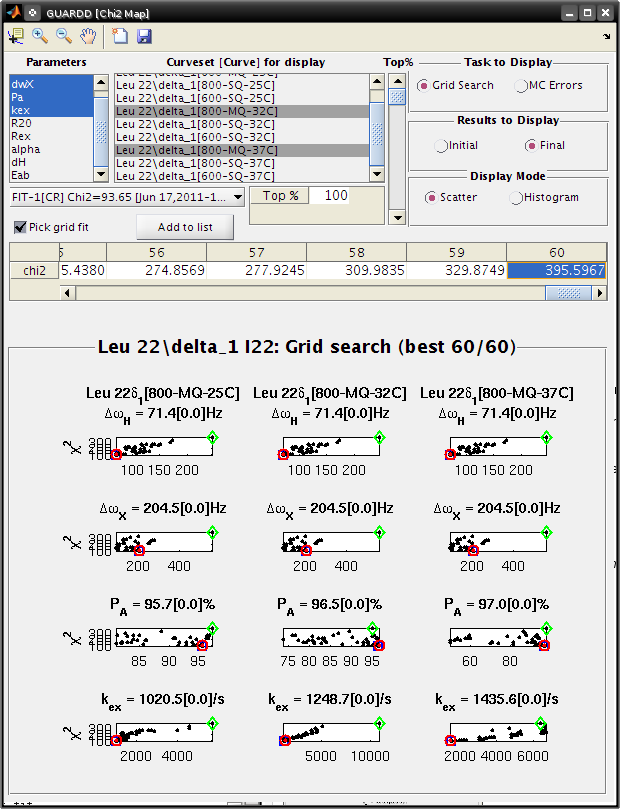

-  Tutorial: select fit from grid search 

Display Monte Carlo Errors
##########################

**Key info on Monte Carlo analysis** 

-  The goal of MC analysis is to generate and fit many *synthetic* datasets which differ from one another by an amount related to the goodness of fit to the original data 
-  Each synthetic dataset will have a different set of optimal fit values (e.g., P\ :sub:`A`, k\ :sub:`ex`)
-  The distribution of fitted values reflects the degree to which the original data define its *own* optimal values 
   - Example: A worse optimal fit to the original data yields *more different* MC datasets and therefore *more different* optimal parameter values

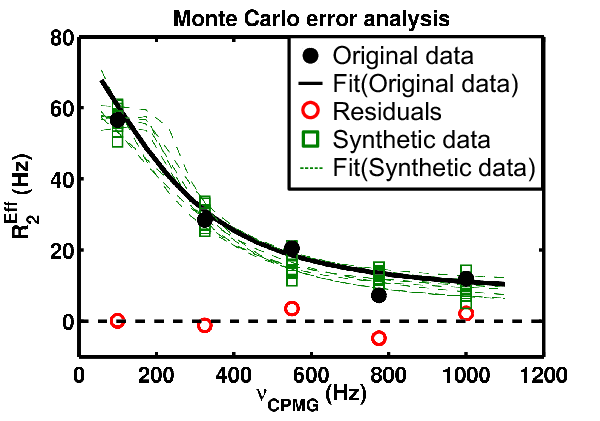

*Figure above* The example data contains 5 observations (black), 5
residuals (red), and 10 synthetic datasets (green squares), each with
their own fit (green dotted lines) and set of optimized parameter
values

**Goal**: *Interpret the MC Errors results the Chi2 Map window* 

#. Eachsubplot shows a single parameter on the X-axis, and its different
   values in different fits 
#. Each *black point* corresponds to ONE optimized fit result to a synthetic MC dataset 
#. There are 100 fits in this example (hence 100 points in each subplot), each of which
   corresponds to a synthetic MC dataset 
#. The initial conditions to each fit are given by the best fit to the original data (see *Results
   to display*: Initial) 
#. The *red circle* designates the best fit to the original data 
#. Set *Display Mode*: Histogram 
#. The gray lines show the hypothetical distributions reflecting “errors” in the data 
#. The *mean* of each distribution is from the best fit value to the
   original data 
#. The *standard deviation* of each distribution is the standard deviation from the distribution of MC fitted values 
#. Each deviation is reported as the “error” in each fitted parameter (shown in brackets) 
#. *Note*: it is usually best to use a *Top%*\ =100% for MC errors

   -  Sometimes anomalous fits yield very large χ\ :sup:`2`, and can be
      discarded, but this is rare

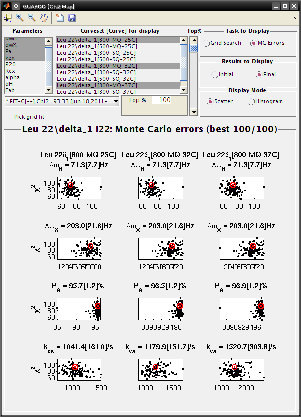

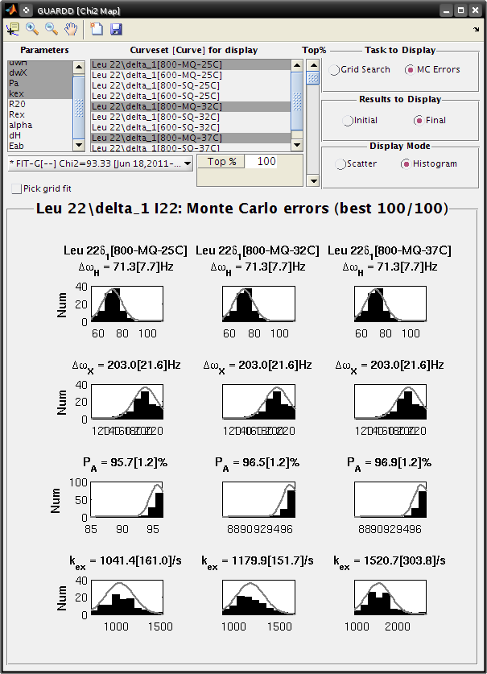

-  Tutorial: View Monte Carlo results for a good fit
-  Tutorial: View Monte Carlo results for a bad fit
-  See related: Monte Carlo error estimation

Display rates
#############

**Goal:** Display results of rate analysis using Arrhenius and vant Hoff relations

-  Tutorial: view the rates 
-  See related: Arrhenius equations
-  See related: vant Hoff equations

Display group results
#####################

**Goal**: Visually organize fitting results to seek the nature of molecular motions

.. image:; tutorial-GUARDD-2011.06.17--10.png

-  *Button: New* → Add new empty DisplayCluster to hold Groups for
   displaying results
-  *Panel: All Groups* → Lists all Groups available to add/remove
   to/from the selected DisplayCluster
-  *Button: Make selection* → Deprecated function to intelligently
   select Groups from GUARDD
-  *Panel: Groups in DisplayCluster* → Lists all Groups in the selected
   DisplayCluster (can be removed)

-  *Panel: Display Settings*

   -  *Table: Subplots* → Used to create a set of subplots for the
      display
   -  *Plot number* → Select the subplot number (From 1 to Nrow*Ncol)
   -  *Type* → Select plot type (Custom will allow for any parameters to
      be displayed, others are pre-arranged)
   -  *Y-Axis* → Select what to be displayed on Y-axis (non-histogram
      only)}
   -  *X-Axis* → Select what to be displayed on the X-axis
   -  *Table: Plot limits* → Set NaN for auto-limits, or type in your
      own and use linear or log scale (applies to all subplots, sorry!)
   -  *Checkbox: Show Histogram* → Shows the histogram (requires only
      X-axis values)

-  Notes

   -  Some paramters plot one point per Group (e.g., P\ :sub:`A` or k\ :sub:`ex`\(37C))
   -  Some parameter plot one point per Curveset (e.g., \|Δω\ :sub:`X`\|) and hence multiple points per Group
   -  Some paramters *could* plot one point per Curve (e.g., R\ :sub:`ex`\) but the FIRST Curve is selected by default
   -  Otherwise there would be too many points on the plot

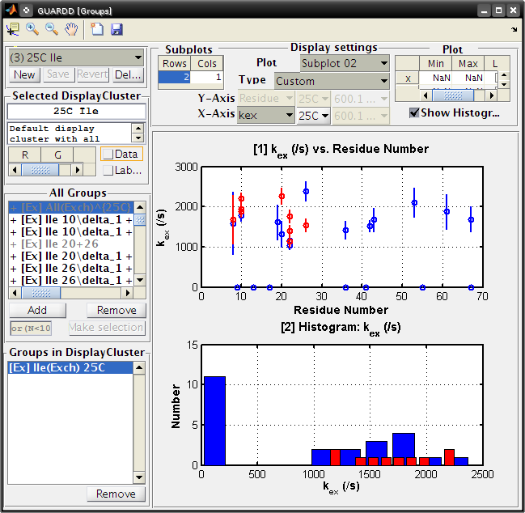

-  Tutorial: View display results in cluster

**Key sections of code**

::

   DisplayCluster.m  

-  Holds information on the name, color, and Groups for display

::

   ParamDisplay.m

-  Holds information for display of the parameters (subplots, X and Y content)

Display results table
#####################

**Goal**: Produce table of results for easy browsing

-  Notes

   -  Table is dynamically generated based on the user’s selection
      criteria from an arbitrary set of RD parameters and Curves

      -  E.g., only P\ :sub:`A` and k\ :sub:`ex` at one temperature, instead of
         all RD parameters for all Curves for all Groups

   -  This customized table can be exported to plain-text for
      publication or external analysis

-  *Button: Export to CSV* → creates two plain-text files (two-column
   format and one-column format)

   -  One is easier for plotting in external programs
   -  Another is easier for preparing a publication quality table

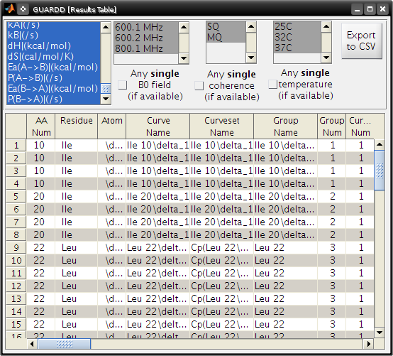

-  Tutorial: display results table

Tips for optimal use
--------------------

Program tips
^^^^^^^^^^^^
-  Save frequently 
-  Drawing windows is relatively slow 
-  Use the main display window to only update displays of interest
-  Use a CPU monitor application to see when GUARDD is processing
results (e.g., fitting, drawing windows, exporting files) 
-  Do not make other changes when performing grid search or error estimates 
-  Data can be viewed but not altered 
-  This is because data structures are stored before the batch run (or a single grid search or single error estimation) then re-saved upon completion of a batch step or single grid search or single error estimation

Fitting tips
^^^^^^^^^^^^
Usually, dispersions with larger R\ :sub:`ex` have a more well-defined solution. Small R\ :sub:`ex` and/or noisy data are usually accompanied by challenges in fitting

-  If unsure about the fit, then don’t interpret fitted parameters
   quantitatively

   -  Additional inaccurate information can obscure proper
      interpretation of dynamics
   -  A poor fit to the two-state model may indicate more complex
      exchange, such as three-state
   -  Note this residue, and consider other fitting equations or more
      complex exchange models (unfortunately, not available in GUARDD
      v.2011.09.11)

-  Three solutions for ill-defined fits
 
#. Select one of the fits, but mark the ill-defined parameters as “Not OK,” thus preventing their
   mis-interpretation in subsequent analyses. 
#. Alter the Group and re-fit. One may remove noisy Curves and/or add additional Curvesets
   to help constrain the values of k\ :sub:`ex` and P\ :sub:`A`. 
#. Acquire more data and re-fit the new Group. The RD Simulator can help determine
   optimal conditions of temperature, magnetic field strength, and/or
   quantum coherence for efficient use of spectrometer time.

-  Check for outliers in fitted data

   -  Check sequence mapping for outliers
   -  Check χ2 and fits for those outliers
   -  What type of exchange do proximal residues exhibit?

-  Make sure fits which show no exchange have “NoEx” model selected as
   best

-  Check neighboring residues

   -  Check dispersions for neighboring residues to get an idea of the
      type of motions one may expect in that region of the structure
   -  If there is concerted motion, then k\ :sub:`ex` and P\ :sub:`A` (and their
      temperature-dependence Ea(A → B), Ea (B → A), dH, dS) will be the
      same (or close) for residues close in structure
   -  Note: There is no requirement that neighboring residues be similar
      though

-  k\ :sub:`ex` is most sensitive fitting parameter

   -  Use the largest number of grid search steps
   -  k\ :sub:`ex` should increase with temperature (e.g., Arrhenius)
   -  P\ :sub:`A` may increase (ΔH < 0), decrease (ΔH > 0) or remain constant
      (ΔH=0) with temperature

GUARDD approach to fast exchange and PhiEx
^^^^^^^^^^^^^^^^^^^^^^^^^^^^^^^^^^^^^^^^^^

**Issue**: In fast exchange (k\ :sub:`ex` >> Δν = Δω / (2π)), the quantities P\ :sub:`A`\, P\ :sub:`B` and Δω
are correlated, and therefore cannot be independently defined

-  **Solution**: sometimes although neither quantity can be defined
   independently, the quantity Φ\ :sub:`ex`\ :sup:`X` =
   P\ :sub:`A`\ P\ :sub:`B`\Δω\ :sub:`X`\ :sup:`2` = P\ :sub:`A`\(1-P\ :sub:`A`)Δω\ :sub:`X`\ :sup:`2`,
   where X refers to the X nucleus, can be well-defined (Luz, 1963; Ishima, 1999)

-  Examine Φ\ :sub:`ex`\ :sup:`X` in the Chi2 Map window to help assess the
   sensitivity of the final fit to either initial conditions (via grid
   search) or to noise in the data (via Monte Carlo error estimation)

   -  In some cases, the parameters P\ :sub:`A` and Δω\ :sub:`X` are relatively
      sensitive to initial conditions (wide χ\ :sup:`2` maps), whereas
      Φ\ :sub:`ex` is relatively less sensitive (more narrow χ\ :sup:`2`
      map), which may indicate that it is reasonable to interpret
      Φ\ :sub:`ex`, but not P\ :sub:`A`.

-  The Chi2 Map window displays a correlation plot of the optimized
   values of Δω\ :sub:`X`\ :sup:`2` and P\ :sub:`A`\P\ :sub:`B`. In fast exchange, a
   strong correlation between these parameters yields a line of points,
   facilitating detection of fast exchange.

-  Check for fast exchange via the Fit RD window by comparing values of
   k\ :sub:`ex` and Δω as well as the exchange parameter α, which indicates
   fast exchange in the range 1.0 to 2.0 (Millet et al., 2000).

Limitations
-----------

**Liabilities of linkage to MATLAB** 

-  GUARDD is slower than if it were coded using C or Python, for example 

-  MATLAB is an interpreted language 

-  Graphical interface uses Java 

-  Drawing the display, while reading or writing large session files, or while fitting data 

-  Malfunctions in MATLAB may hinder functionality of GUARDD

-  However, enhancements to MATLAB may imbue enhancements to GUARDD 

-  User must have access to MATLAB (i.e., GUARDD is not a standalone program)

-  However, MATLAB is a convenient cross-platform solution for dissemination of software 

-  Cannot be run using Octave, which can run many other MATLAB programs 

   -  http://www.gnu.org/software/octave/

-  Octave does not support the graphical user interface that is a key feature of GUARDD

   -  http://www.gnu.org/software/octave/FAQ.html#MATLAB-compatibility 

-  For what its worth, Octave supports a distinct GUI library called “Zenity” 

   -  http://octave.sourceforge.net/zenity/

**Limitations of GUARDD functionality** 

-  Exchange model is restricted to two-state using the all-timescales MQ Carver-Richards-Jones formulation

-  No simplifications assuming skewed populations (P\ :sub:`B` < P\ :sub:`A`\) (Ishima, 1999) 

-  No simplifications assuming fast-exchange (k\ :sub:`ex` > Δν) 

-  No three-site exchange 

-  No ZQ or DQ coherences 

-  No pressure-dependence of RD 

-  No Anti-TROSY/TROSY analysis 

-  No temperature-dependence via transition state theory 

-  No error analysis options: jacknife, covariance matrix method

Feedback, Suggestions, Bugs
---------------------------

Please report bugs, suggestions, etc. in the Issues page_.

.. _page: http://code.google.com/p/guardd/issues/list

Computational procedures
------------------------

Convert NMR signal intensity to relaxation rate
^^^^^^^^^^^^^^^^^^^^^^^^^^^^^^^^^^^^^^^^^^^^^^^

**Goal**: Given NMR signal intensites, generate a relatxation Curve

-  **Input** 

   #. I(ν\ :sub:`CPMG`\) = signal intensity in the 2D spectrum acquired with refocusing frequency ν\ :sub:`CPMG` 

   #. I\ :sub:`0` = reference signal intensity obtained in the spectrum with no refocusing block 

   #. T\ :sub:`CPMG` = duration of the refocusing block

-  **Output** 
   
   #. R\ :sub:`2`\ :sup:`Eff` 

   #. Errors in intensities σ(R\ :sub:`2`\ :sup:`Eff`) are estimated via standard deviation from repeat measures of I(ν\ :sub:`CPMG`)

R\ :sub:`2`\ :sup:`Eff` = -ln( I(ν\ :sub:`CPMG`)/I\ :sub:`0`) / T\ :sub:`CPMG`

Converting ppm to rad/s
^^^^^^^^^^^^^^^^^^^^^^^

**Goal**: Obtain rad/s quantity for chemical shift difference using ppm value \* *Note* rad/s is requried for trigonometric functions, like tangent

**Note**: Hz = /s is useful for direct comparison to k\ :sub:`ex` (also in /s) in determining exchange timescale

-  **Input**

   -  ω\ :sub:`X` (rad/s)
   -  γ\ :sub:`X` (from nucleus identity)
   -  B\ :sub:`0`

-  **Output**

   -  ω\ :sub:`X`\(rad/s) = 2πB\ :sub:`0`\γ\ :sub:`X`\ω\ :sub:`X`\(ppm)
   -  ν\ :sub:`X`\(Hz) = B\ :sub:`0`\γ\ :sub:`X`\ω\ :sub:`X`\(ppm)

Carver-Richards Jones for MQ disperstions
^^^^^^^^^^^^^^^^^^^^^^^^^^^^^^^^^^^^^^^^^

**Goal**: Obtain dispersion Curve R\ :sub:`2`\ :sup:`Eff` as a function of ν\ :sub:`CPMG` given a
set of 5 parameters

-  **Input** 

   #. Δω\ :sub:`H` 

   #. Δω\ :sub:`X` 

   #. P\ :sub:`A` 

   #. k\ :sub:`ex` 

   #. R\ :sub:`2`\ :sup:`0`
 
   #. ν\ :sub:`CPMG`

-  **Process** 

   #. δ = 1 / (4ν\ :sub:`CPMG`)
 
   #. n = T\ :sub:`CPMG`\ν\ :sub:`CPMG`

   #. Note: MQ simplifies to SQ if Δω\ :sub:`H` = 0 

   #. (See equations below)

-  **Output**

   #. R\ :sub:`2`\ :sup:`Eff`

-  **Location in code**

::

   chi2_MQRD_CRJ_group.m

::

   chi2_MQRD_CRJ.m

-  **Reference**

   -  Korzhnev (2004)

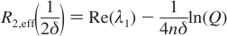

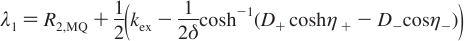

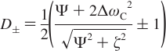

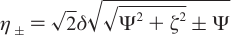

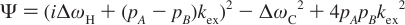

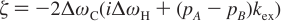

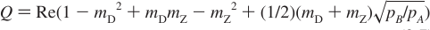

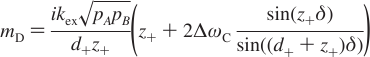

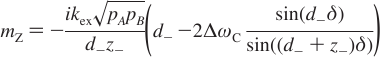

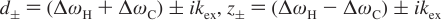

Fitting data
^^^^^^^^^^^^ 

**Goal**: Obtain a set of parameters that accurately describe RD Curves in the Group
**Goal**: Minimize the sum of squares target function

-  Input 
   
   #. R\ :sub:`2Eff`\ :sup:`Obs` = RD Curve data points 

   #. σ(R\ :sub:`2Eff`\ :sup:`Obs`) = Errors in RD Curve data points 

   #. Curve condition: B\ :sub:`0` 

   #. Curve condition: Temperature 

   #. Curve condition: QC 

   #. Curve condition: :sup:`A`\ X 

   #. Curve condition: T\ :sub:`CPMG` 

   #. Fitting parameters: *p* 

   #. P\ :sub:`A` and k\ :sub:`ex` for each temperature 

   #. \|Δω\ :sub:`H`\| and \|Δω\ :sub:`X`\| for each Curveset 

   #. R\ :sub:`2`\ :sup:`0` for each Curve

-  **Process** 

   #. MATLAB fmincon iteratively alters the fitting parameters

   *p* to minimize the target function χ\ :sup:`2` 

   #. R\ :sub:`2`\ :sup:`Calc` = calculated point using the Curve conditions and the independent fitting parameters *p* for the Group 

   #. χ\ :sup:`2` becomes smaller as the Curve fit more closely matches the observed data

-  *Output* 

   #. χ\ :sup:`2`

-  *Location in code*

::

   FitResult.fitMe

-  *References*

   -  MATLAB_.

   .. _MATLAB: http://www.mathworks.com/help/toolbox/optim/ug/fmincon.html

   -  MATLAB interior point algorithm_. 

   .. _algorithm: http://www.mathworks.com/help/toolbox/optim/ug/brnoxzl.html#brnpd5f

   -  Bevington (2003)
   -  Motulsky (2003)

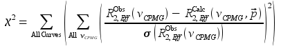

Exchange broadening
^^^^^^^^^^^^^^^^^^^

**Goal**: Estimate exchange broadening R\ :sub:`ex` (height of the dispersion Curve) using the fitted RD Curve

-  *Input* 

   #. R\ :sub:`2Eff`\ :sup:`Calc` = RD Curve data points 

   #. σ(R\ :sub:`2Eff`\ :sup:`Obs`) = Errors in RD Curve data points 

   #. Curve condition: B\ :sub:`0` 

   #. Curve condition: Temperature 

   #. Curve condition: QC 

   #. Curve condition: :sup:`A`\ X 

   #. Curve condition: T\ :sub:`CPMG` 

   #. Fitting parameters: *p* 

   #. P\ :sub:`A` and k\ :sub:`ex` for each temperature 

   #. |\Δω\ :sub:`H`\| and |\Δω\ :sub:`X`\| for each Curveset 

   #. R\ :sub:`2`\ :sup:`0` for each Curve

-  *Process*

   #. Sometimes evaluation at 0 Hz is not valid, therefore try 1 Hz, then2 Hz, … 

   #. Try to use ν\ :sub:`CPMG` values as close to 0 and infinity as possible

-  *Output* 

   #. R\ :sub:`ex`

-  *Location in code*

::

   FitResult.analyzeMe()

::

   calculate_Rex.m

R\ :sub:`ex` ~ R\ :sub:`2Eff`\ :sup:`Fit`\ (ν\ :sub:`CPMG`\~0 Hz) -
R\ :sub:`2Eff`\ :sup:`Fit`\ (ν\ :sub:`CPMG` ~10\ :sup:`4`\Hz)

Exchange timescale alpha
^^^^^^^^^^^^^^^^^^^^^^^^

**Goal**: Estimate scaling factor α for time regime of chemical exchange

-  Input 

   #. R\ :sub:`ex` at at least two field strengths 

   #. Δω at the same field strengths

-  *Output* 

   #. α

   -  0 <= α < 1 *Slow exchange*
   -  α = 1 *Intermediate exchange*
   -  1 < α <= 2 *Fast exchange*

-  *Location in code*

::

   FitResult.analyzeMe()

::

   calculate_alpha.m

-  *Reference*

   -  Millet, et al. (2000)

α = d( ln(R\ :sub:`ex`) ) / d( ln(Δω) )

Exchange quantity PhiEx
^^^^^^^^^^^^^^^^^^^^^^^

**Goal**: Calculate quantity Φ\ :sub:`ex` that appears in fast-exchange approximation to RD equations

Sometimes this quantity is well-defined despite correlated/ill-defined P\ :sub:`A` and Δω

-  Input 

   #. P\ :sub:`A` 

   #. Δω\ :sub:`X` where X is the X nucleus

-  Output 

   #. Φ\ :sub:`ex`\ :sup:`X` (Hz\ :sup:`2`\)

-  Location in code

::

   FitResult.analyzeMe()

-  *Reference*

   -  Luz & Meiboom (1963)
   -  Ishima & Torchia (1999)

Φ\ :sub:`ex`\ :sup:`X` = P\ :sub:`A`\ P\ :sub:`B`\ Δω\ :sub:`X`\ :sup:`2` =
P\ :sub:`A`\(1-P\ :sub:`A`\)Δω\ :sub:`X`\ :sup:`2`

Arrhenius: Determining activation energy
^^^^^^^^^^^^^^^^^^^^^^^^^^^^^^^^^^^^^^^^

**Goal**: Obtain activation energy and pre-exponential rate to characterize temperature-dependence of rate

-  *Input* 

   #. P\ :sub:`A` at 2+ temperatures 

   #. k\ :sub:`ex` at the same temperatures

-  *Process* 

   #. R = gas constant 

   #. T = absolute temperature 

   #. k = k\ :sub:`A` = (1-P\ :sub:`A`)k\ :sub:`ex` (or k\ :sub:`B` = P\ :sub:`A`\ k\ :sub:`ex`) = kinetic rate of
      exchange from A→B (or B→A) 

   #. Errors from MATLAB’s fit routine (provided data at more than two temperatures), or from propagation of
      relative error from the fitting variables (when limited to data at only two temperatures).

-  *Output*

   #. P = P\ :sub:`AB` (or P = P\ :sub:`BA`) Pre-exponential rate, the exchange
      rate from A→B (or B→A) at infinite temperature 

   #. E = E\ :sub:`AB` (or E = E\ :sub:`BA`) = Activation energy (≈ enthalpy) required to exchange from
      A→B (or B→A)

-  *Location in code*

::

   RateAnalysis.analyzeMe

-  *Reference*

   -  Winzor & Jackson (2006)

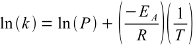

vant Hoff: Determining enthalpy
^^^^^^^^^^^^^^^^^^^^^^^^^^^^^^^

**Goal**: Obtain exchange enthalpy and entropy to characterize temperature-dependence of population

-  Input 

   #. P\ :sub:`A` at 2+ temperatures

-  Process 

   #. R = gas constant 

   #. T = absolute temperature 

   #. K = (1-P\ :sub:`A`) / P\ :sub:`A` = k\ :sub:`A` / k\ :sub:`B` = equilibrium constant for
      exchange 

   #. Errors from MATLAB’s fit routine (provided data at more than two temperatures) 
      Or from propagation of relative error from the fitting variables (when limited to data at only two temperatures).

-  *Output*

   #. ΔS = system entropy change from A→B 

   #. ΔH = system enthalpy change from A→B

-  *Note*: Entropy is unreliable since it is highly sensitive to
   relatively noisy input data

-  *Location in code*

::

   RateAnalysis.analyzeMe

-  *Reference*

   -  Winzor & Jackson (2006)

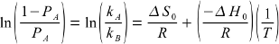

Kinetic simulator
^^^^^^^^^^^^^^^^^ 

**Goal**: Itemizes all kinetic parameters of interest for two-state exchange, given minimal input required

-  Input 

   #. ΔH 

   #. E\ :sub:`AB`
 
   #. k\ :sub:`ex`\ :sup:`0` = k\ :sub:`ex`\(T\ :sub:`0`\) 

   #. P\ :sub:`A`\ :sup:`0` = P\ :sub:`A`\(T\ :sub:`0`\) 

   #. T\ :sub:`0` is an arbitrary temperature

-  Process

   #. R = gas constant 

   #. T = absolute temperature 

   #. (See below)

-  Output 

   #. ΔH 

   #. ΔS
 
   #. E\ :sub:`AB` 

   #. P\ :sub:`AB`
 
   #. E\ :sub:`BA` 

   #. P\ :sub:`BA`
 
   #. k\ :sub:`ex`\(T) 

   #. P\ :sub:`A`\(T) 

   #. k\ :sub:`A`\(T) 

   #. k\ :sub:`B`\(T) 

   #. T is an arbitrary temperature

-  Location in code

::

   SimulationCurveset.setKineticSpecs

   SimulationCurveset.calc_PA

   SimulationCurveset.calc_kA

   SimulationCurveset.calc_kex

   SimulationCurveset.calc_kB

-  *Reference*

   -  Winzor & Jackson (2006)

Using ΔH and P\ :sub:`A`\(T0), the van’t Hoff relation yields ΔS

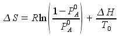

which, with ΔH, determines P\ :sub:`A` at any temperature via van’t Hoff

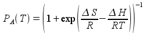

Next, using P\ :sub:`A` and k\ :sub:`ex` at T\ :sub:`0` determines k\ :sub:`A` and k\ :sub:`B` at
T\ :sub:`0`

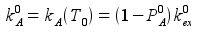

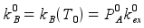

and using E\ :sub:`AB` and k\ :sub:`A` at T\ :sub:`0`, the Arrhenius relation yields
P\ :sub:`AB`

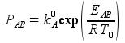

which, with E\ :sub:`AB`\, yields k\ :sub:`A` at any temperature via Arrhenius

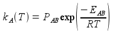

Next, knowledge of P\ :sub:`A` and k\ :sub:`A` at any temperature yields k\ :sub:`ex`
at any temperature

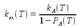

and therefore k\ :sub:`B` at any temperature

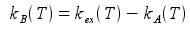

Knowledge of k\ :sub:`B` at any temperature yields E\ :sub:`BA` via the Arrhenius
relation and selection of any two temperatures T\ :sub:`1` and T\ :sub:`2` (e.g.,
280 K and 320 K)

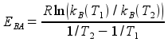

Finally, using k\ :sub:`B`\(T\ :sub:`0`) and E\ :sub:`BA`\, the Arrhenius relation yields
P\ :sub:`BA`

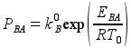

Grid search 
^^^^^^^^^^^

**Motivation:** Nonlinear nature of RD phenomena makes the relationship between χ\ :sup:`2` and fitting
parameters (*p*) difficult to predict \* Optimization algorithms often “fail” by finding a local minimum of χ\ :sup:`2`, which is sensitive to initial fitting conditions, instead of the intended global minimum of χ\ :sup:`2`

**Goal**: Fit data multiple times to assess sensitivity of final fit
  to initial conditions

-  *Six-dimensional (6D) grid search* 

   #. \|Δω\ :sub:`H`\| 

   #. \|Δω\ :sub:`X`\| 

   #. P\ :sub:`A`\ :sup:`0` = P\ :sub:`A(T)`\, where T is a specified
      temperature (e.g., 25C) 

   #. k\ :sub:`ex`\ :sup:`0` = k\ :sub:`ex`\(T\ :sub:`0`\), where T\ :sub:`0` is a specfied temperature (e.g., 25C) 

   #. E\ :sub:`AB` (only for consraining rates via Arrhenius) 

   #. ΔΗ (only for consraining rates via Arrhenius)

-  *Each point specifies initial conditions for the fit, as follows*

   -  Δω values are used for every Curveset in the Group

      -  Note: this may be sub-optimal since each Curveset can have a
         different Δω value

   -  If constrain rates is NOT used

      -  P\ :sub:`A`\ :sup:`0` is used for all temperatures in the Group
      -  k\ :sub:`ex`\ :sup:`0` value is used at temperature T\ :sub:`0` and
         increased by 2x for each increase in 10C from T\ :sub:`0` (i.e.,
         k\ :sub:`ex`\(T) = k\ :sub:`ex`\ :sup:`0`\(T-T\ :sub:`0`\)/10)

   -  If constrain rates IS used

      -  P\ :sub:`A`\(T) determined using P\ :sub:`A`\ :sup:`0`\ and ΔH
      -  k\ :sub:`ex`\(T) determined using k\ :sub:`ex`\ :sup:`0`\ and E\ :sub:`AB`

   -  R\ :sub:`2`\ :sup:`0` is always the minimum value of the observed
      R\ :sub:`2` in the Curve

Recommendations on bounds at T\ :sub:`0` = 25C

+-----------+--------------------+--------------------+----------------------------+-----------------------+-------------------------+---------------+
| Iteration | Δω\ :sub:`H`\(ppm) | Δω\ :sub:`Χ`\(ppm) | P\ :sub:`A`\ :sup:`0`\ (%) | k\ :sub:`ex`\ 0\ (/s) | E\ :sub:`AB` (kcal/mol) | ΔH (kcal/mol) |
+===========+====================+====================+============================+=======================+=========================+===============+
| Min       | 0.01               | 0.1                | 70                         | 500                   | -20                     | -20           |
+-----------+--------------------+--------------------+----------------------------+-----------------------+-------------------------+---------------+
| Max       | 0.2                | 3                  | 99.9                       | 3500                  | 20                      | 20            |
+-----------+--------------------+--------------------+----------------------------+-----------------------+-------------------------+---------------+
| Steps     | 1-3                | 2-5                | 2-10                       | 3-10                  | 2-5                     | 2-5           |
+-----------+--------------------+--------------------+----------------------------+-----------------------+-------------------------+---------------+

**Recommendations on number of steps**

+------------+-------------+------------+------------------------------------------+
| Group Size | Num(Curves) | Num(Steps) | Notes                                    |
+============+=============+============+==========================================+
| Small      | 1-5         | 5-50       | Easy to fit, usually only one solution   |
+------------+-------------+------------+------------------------------------------+
| Medium     | 5-10        | 20-100     | Usually easy to fit, few solutions       |
+------------+-------------+------------+------------------------------------------+
| Large      | 10-20       | 100-200    | Sometimes challenging, several solutions |
+------------+-------------+------------+------------------------------------------+
| Very Large | 50-100      | 500+       | Very challenging to fit                  |
+------------+-------------+------------+------------------------------------------+

-  Unsorted notes

   -  k\ :sub:`ex` seems to be a very sensitive parameter, use the most
      points here
   -  Sometimes MATLAB does not alter Δω values for multiple Curvesets
   -  E\ :sub:`AB` and ΔH can be very difficult to optimize via grid search

-  *Location in code*

::

   Group.gridSearch

Monte Carlo error estimation
^^^^^^^^^^^^^^^^^^^^^^^^^^^^

**Motivation**: *The final fit to RD data are sometimes very sensitive to noise in the data* 

**Goal**: Generate and fit multiple synthetic data to assess sensitivity of final
fit to noise in data

Monte Carlo procedure generates and fits synthetic data consistent with
observed residuals (related to noise)

**Procedure**

#. Calculate residuals for each ν\ :sub:`CPMG` value in a given Curve

   - ε(ν\ :sub:`CPMG`\) = R\ :sub:`2Eff`\ :sup:`Obs`\(ν\ :sub:`CPMG`\) - R\ :sub:`2Eff`\ :sup:`Calc`\(ν\ :sub:`CPMG`\)

- The residuals are used to create a normal distribution for the Curve with mean and variance

  -  Norm(mean(ε), var(ε))

-  Alternatively, the experimental errors σ(R\ :sub:`2Eff`\ :sup:`Obs`) can be used

   -  **Norm(mean(σ), var(σ))**

-  Generate a synthetic dispersion Curve using the fit at each ν\ :sub:`CPMG` plus a random sample from the distribution

   -  R\ :sub:`2Eff`\ :sup:`Synth` = R\ :sub:`2Eff`\ :sup:`Calc`\(ν\ :sub:`CPMG`\) + Sample( Norm(mean(ε), var(ε)) ), or using Norm(mean(σ), var(σ))

-   Repeat for each Curve in the Group such that a synthetic Group is produced

-   Fit the synthetic Group using initial conditions from the best fit of the actual data.

-   Repeat (3)-(5) multiple times (default 100x, can be changed in settings “Nmc”)

This yields 100 synthetic Groups and 100 sets of optimized fit
parameters

-   Calculate the error in a given parameter as the standard deviation
    of the optimized fit parameter from its 100 element distribution

-   Errors in subsequent quantities (e.g., k\ :sub:`A`, k\ :sub:`B` ln(k\ :sub:`A`),
    etc.) are estimated using propagation of error assuming all
    parameters are uncorrelated (zero covariance)

**Notes**

-  Number of MC error iterations can be set via

::

   Input…Settings…Nmc

-  Debugging output can display the fits to each data via

::

   Input…Settings…OUTPUT_DEBUG_ERRORS

**Location in code**

::

   FitResult.calculateErrors

**Reference**

-  Motulsky (2003), p. 108

Glossary
^^^^^^^^

-  :sup:`A`\X: Any nucleus with mass number A and chemical symbol X (e.g,. \ :sup:`1`\ H, :sup:`13`\ C, :sup:`15`\ N) 
-  B\ :sub:`0`: Magnetic field strength (Tesla) 
-  C: Curve number within the curveset 
-  Chi2: χ\ :sup:`2`; Goodness of fit metric (smaller
   value indicates better fit) 
-  CPMG: Carr-Purcell Meiboom-Gill (four scientists who poineered relaxation dispersion methods) 
-  CS: Curveset number 
-  CTOT: Total curve number within the group 
-  Curve: A single set of R2Eff(νCPMG) data points 
-  Curveset: Designates a ΔωH and ΔωX to a set of one or more Curves 
-  DQ: Double Quantum (not implemented in GUARDD) 
-  E\ :sub:`AB`: E\ :sub:`B` - E\ :sub:`A`; Activation energy to exchange from A→B (cal/mol)
-  G: Group number 
-  Group: Designates a P\ :sub:`A`
   and k\ :sub:`ex` at each temperature for a set of one or more Curvesets 
-  GUARDD: Graphical User-friendly Analysis of Relaxation
   Dispersion Data 
-  GUI: Graphical User Interface 
-  k\ :sub:`A`\: (1-P\ :sub:`A`)k\ :sub:`ex`; Rate of exchange from A→B 
-  k\ :sub:`B`\: P\ :sub:`A`\k\ :sub:`ex`; Rate of exchange from B→A 
-  k\ :sub:`ex`\: k\ :sub:`A` + k\ :sub:`B`; Total exchange rate between states (/s) 
-  MC: Monte Carlo (randomization method used here for
   error analysis) 
-  MQ: Multiple Quantum (signal detected in
   NMR); Note: MQ RD curves are sensitive to *both* Δω\ :sub:`H` and Δω\ :sub:`X`
-  NMR: Nuclear Magnetic Resonance 
-  NMR probe: One
   nucleus in the target molecule that can be observed via NMR;
   designated a unique unique residue number (e.g., 1,2,3,…) and atom
   (e.g,. H\ :sup:`N`, C\ :sup:`O`, Cδ\ :sub:`2`) 
-  P\ :sub:`A`: Populationfraction of A state (fraction, %) 
-  ppm: Parts Per Million (a dimensionless unit of measure for relative comparison) 
-  R: Gas constant 
-  R\ :sub:`2`\ :sup:`0`: Transverse relaxation rate in the absence
   of exchange (Hz) 
-  RD: Relaxation Dispersion 
-  SQ: Single Quantum (signal detected in NMR); Note: SQ curves that pulse on
   :sup:`A`\ X nucleus are sensitive *only* to Δω\ :sub:`X` (Δω\ :sub:`H` is fixed
   to zero) 
-  T\ :sub:`CPMG`: Total duration of the CPMG block in the NMR RD experiment 
-  ZQ: Zero Quantum (not implemented in
   GUARDD) 
-  γ\ :sub:`X`: Gyromagnetic ratio for nucleus X (MHz/Tesla)
-  ΔH: H\ :sub:`B` - H\ :sub:`A`; Enthalpy difference to exchange from A→B (cal/mol) 
-  Δν: Chemical shift difference in Hz 
-  Δω\ :sub:`H`: :sup:`1`\ H chemical shift difference between states A and B (ppm, rad/s) - *MQ only* 
-  Δω\ :sub:`X`: :sup:`A`\ X chemical shift difference between states A and B (ppm, rad/s) 
-  ν\ :sub:`CPMG`: Precession frequency of refocused magnetization during CPMG period of NMR RD experiment

References/Further Reading
--------------------------

**Please cite your usage of GUARDD in BOTH ways**
 
-  Kleckner, I. R., & Foster, M. P. (2012). GUARDD: user-friendly MATLAB software for rigorous analysis of CPMG RD NMR data. Journal of biomolecular NMR, 52(1), 11–22. 
 
-  http://code.google.com/p/guardd/ 

**Review on protein dynamics via NMR** 

-  Kleckner, I. R., & Foster, M. P. (2011). An introduction to NMR-based
   approaches for measuring protein dynamics. Biochimica et biophysica
   acta, 1814(8), 942-968. Elsevier B.V. doi: 10.1016/j.bbapap.2010.10.012.

**Fitting RD data is poorly determined** 

-  Kovrigin, E. L., Kempf, J. G., Grey, M. J., & Loria, J. P. (2006). Faithful estimation of dynamics
   parameters from CPMG relaxation dispersion measurements. Journal of
   magnetic resonance (San Diego, Calif. : 1997), 180(1), 93-104. doi:
   10.1016/j.jmr.2006.01.010. 
-  Ishima, R., & Torchia, D. a. (2005). Error estimation and global fitting in transverse-relaxation dispersion
   experiments to determine chemical-exchange parameters. Journal of
   biomolecular NMR, 32(1), 41-54. doi: 10.1007/s10858-005-3593-z. 

**Fast exchange approximation** 

-  Luz, Z. & Meiboom, S. (1963). Nuclear magnetic resonance study of protolysis of trimethylammonium ion in
   aqueous solution - order of reaction with respect to solvent. J. Chem.
   Phys., 39, 366-370. 
-  Ishima, R. & Torchia, D.A. (1999). Estimating the
   time scale of chemical exchange of proteins from measurements of
   transverse relaxation rates in solution. Journal of Biomolecular NMR,
   14, 369-72. [http://view.ncbi.nlm.nih.gov/pubmed/10526408] 

**MQ dispersion**

-  Korzhnev, D. M., Kloiber, K., & Kay, L. E. (2004). Multiple-quantum relaxation dispersion NMR spectroscopy probing
   millisecond time-scale dynamics in proteins: theory and application.
   Journal of the American Chemical Society, 126(23), 7320-9. doi:10.1021/ja049968b. 

**Quantum Coherences in dispersion** 

-  Korzhnev, D.M., Neudecker, P., Mittermaier, A., Orekhov, V. Y., & Kay, L. E. (2005).
   Multiple-site exchange in proteins studied with a suite of six NMR
   relaxation dispersion experiments: an application to the folding of a
   Fyn SH3 domain mutant. Journal of the American Chemical Society,
   127(44), 15602-11. doi: 10.1021/ja054550e. 

**Exchange timescale α** 

-  Millet, O., Loria, J. P., Kroenke, C. D., Pons, M., & Palmer, A. G.
   (2000). The Static Magnetic Field Dependence of Chemical Exchange
   Line broadening Defines the NMR Chemical Shift Time Scale. Journal of the
   American Chemical Society, 122(12), 2867-2877. doi: 10.1021/ja993511y.

**Nonlinear fitting** 

-  P, B., & D, R. (2003). Data reduction and
   error analysis for the physical sciences. (D. Bruflodt, Ed.) (3rd ed.).
   New York, NY: McGraw-Hill. 

-  Motulsky, H. J., & Christopoulos, A. (2003). Fitting models to biological data using linear and nonlinear
   regression. A practical guide to curve fitting. (GraphPad Software Inc.,
   Eds.) (2nd ed.). San Diego CA: GraphPad Software Inc.
 
**Temperature-dependence of rate and equilibrium constants (Arrhenius and
vant Hoff analyses)** 

-  Winzor, D. J., & Jackson, C. M. (2006). Interpretation of the temperature dependence of equilibrium and rate
   constants. Journal of Molecular Recognition, c(August), 389-407. doi: 10.1002/jmr.
