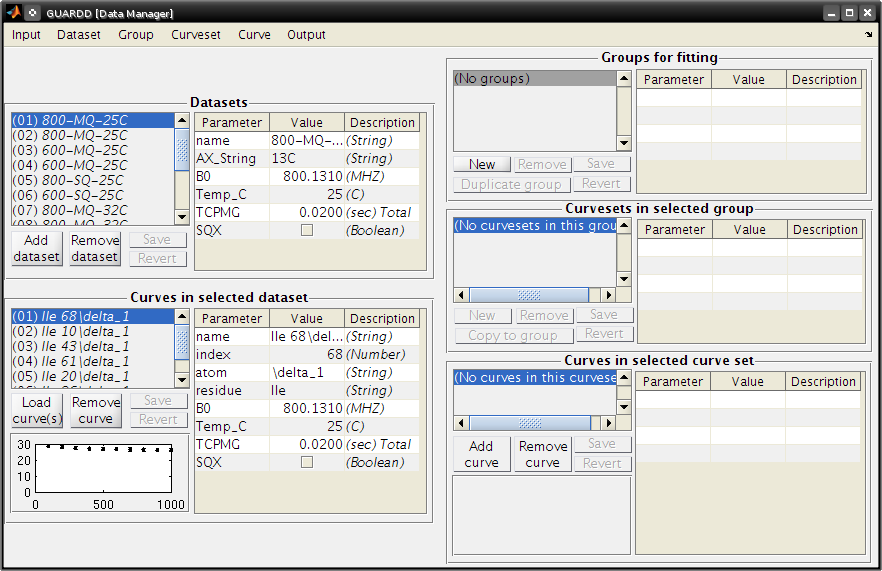
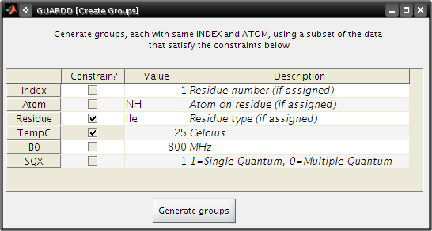
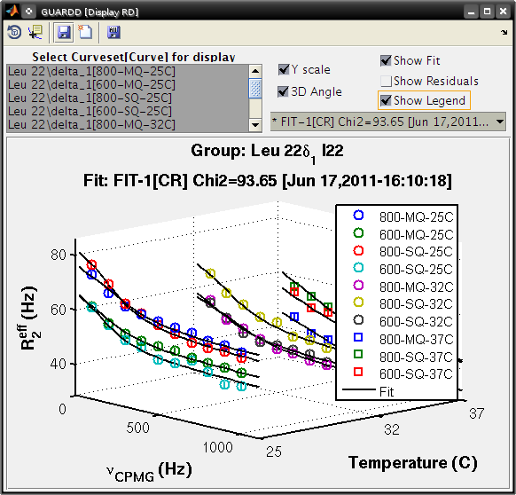
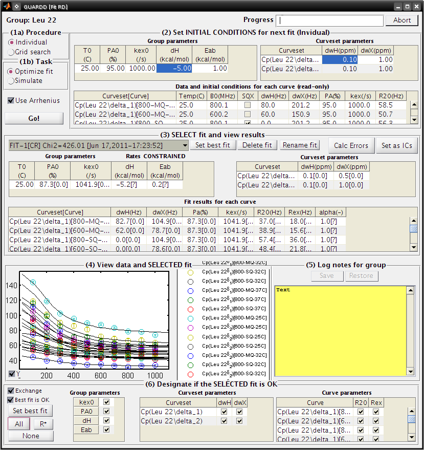
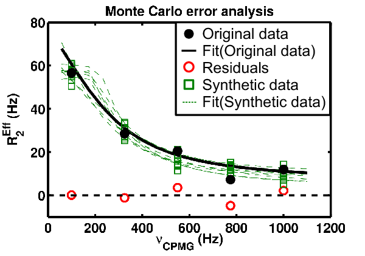

Tutorial
========

General notes
-------------

-  Sample data for this tutorial is provided here_. 

   .. _here: http://code.google.com/p/guardd/downloads/list

-  Tutorial images shown below are from GUARDD v.2011.07.01 and associated GUARDD-Session-Tutorial.mat file

-  This tutorial is also compatible with GUARDD v.2011.09.11 and associated GUARDD-Session-Tutorial.mat file

-  v.2011.09.11 session uses more points in grid search than the v.2011.07.01 session (150 vs. 60)

- See Manual for Glossary

-  GUARDD utilizes multiple GUI windows (may need to be resized)

-  Higher monitor resolution helps (1024x768 minimum)

-  Matlab **must remain open** since it controls GUARDD

-  GUARDD Main window **must remain open** since it controls other GUI windows

-  Check Matlab command window for additional output

-  GUARDD is sometimes slow. Turn on CPU monitor to see when program is processing

-  Win: Ctrl+Alt+Del, click Task Manager, watch icon in task bar

-  Mac: Applications folder → Utilities folder → launch
   Activity Monitor

-  "Tooltips" are revealed by hovering mouse cursor over buttons, tables, etc

Download and unpack files
-------------------------

-  Download Files here_.

   .. _here: http://code.google.com/p/guardd/downloads/list

-  Unpack files

   -  E.g., /home/user/Desktop/ or C:\My_Favorite_Folder\\

Ensure proper directory structure
---------------------------------

-  GUARDD--YYYY.MM.DD/ (*Note*: YYYY.MM.DD codes for the date (e.g.,2011.06.17))

-  There should also be a "tutorial" folder present, along with many .m and .fig files 

Start GUARDD
------------

-  Start **Matlab**

-  Open Matlab command window: **Desktop...Command Window**

-  Navigate to GUARDD/ directory and start program

-  Matlab command window: 

::

   cd c:\My_Favorite_Folder\GUARDD--YYYY.MM.DD\

-  **Note**: YYYY.MM.DD is replaced by the date corresponding to the GUARDD version (e.g., 2011.06.08)

-  To launch GUARDD, enter GUARDD in the command line: 

::

   clear; GUARDD

**Important**: *Main window must remain open since it controls other GUI windows!*

Check Matlab command window for additional output

Load data
---------

**Goal:** Get Relaxation Dispersion data into the program for analysis

- From the **Main** GUARDD window, select the **Input** tab and click on **Data Manager**

- In the **Data Manager** window, select **Input** and click on **Script**

- Open the following file

::
   
    tutorial/data/GUARDD-Data-ApoTRAP-Kleckner.txt

**Note:** There are two methods for importing your data to GUARDD

-  Generate a data script

   - Each data script will adhere to the following format

::

   NAME:	"The name for your dataset"
   AX:		"Nucleus (e.g. 13C, 15N)"
   B0:		"External field strength in units of MHz (e.g. 800.130981)" 
   TEMPC:	"Temperature in units of degrees Celsius" 
   TCPMG:	"CPMG time in units of seconds"
   SQX:		"Boolean; set this to True if you're analyzing a single quantum dataset. Set it to False otherwise."
   SETSPECS:	"This will set the previous specifications for the current dataset"
   
   INDEX:	"The identifier for the NMR signal. This is ideally a number (e.g. 26 if the signal corresponds to Ile26)"
   ATOM: 	"The atom being analyzed (e.g. NH, CO, \delta_1)"
   Residue	"Three letter code for the amino acid being analyzed (e.g. Ile for Isoleucine)"
   OBS		VCPMG		R2		ERROR
   
\
   -  OBS, VCPMG, R2 and ERROR are columns containing data from your CPMG experiment.
   -  OBS will turn observation mode on and is required. This column should be numbered 1 through N where N is the number of data points recorded
   -  The VCPMG column should contain your CPMG pulse frequencies
   -  R2 should contain your observed R2 values at each CPMG frequency
   -  ERROR is optional - this column should contain the errors, if known, for each measured R2 value.  
   -  Example data script: tutorial/data/GUARDD-Data-ApoTRAP-Kleckner.txt

-  An nlin.tab file from NMRPipe (containing your peak information) and a vcpmg.txt file (containing your CPMG pulse frequencies) may be used. 
-  Examples...
     
   -  tutorial/data/example_files/TRAP-SteApo-A26I-25C-800MHz-MQ-14ppm-nlin.tab
   -  tutorial/data/example_files/TRAP-SteApo-A26I-25C-800MHz-MQ-14ppm-taufile.txt

14 datasets loaded

-  600 and 800 MHz
-  25, 32, and 37\ :sup:`o`\C
-  SQ and MQ coherence

Create groups for fitting
-------------------------

-  **Goal**: Aggregate RD curves from the same NMR signal (assignment) for group fitting

**Essential notes on data organization**

-  Datasets designate experimental conditions
-  Datasets contain Curves, which contain RD data
-  Curves are aggregated across common NMR probes (assignment) into Curvesets (to share Δω values)
-  Curvests are aggregated across different NMR probes into Groups (to share k\ :sub:`ex` and P\ :sub:`A`)
-  Details regarding data organization are discussed in the Manual

-  Open the **Data Manager** window
-  Select the **Group** tab and click on **Generate from subsets of data**
-  Create Groups

  -  Make groups only for Ile residues at 25\ :sup:`o`\ C
  -  Check Residue
  -  Type Ile
  -  Check TempC
  -  Type 25

-  Click **Generate Groups**

**Data Manager**

Group...Generate from subset of data...

-  Create Groups

-  Make groups only for index 22

  -  Check Index
  -  Type 22
  -  Click Generate groups

**Data Manager**

-  Select the **Group** tab and click on **Sort Groups**

-  Close the **Data Manager** window

.. image:: tutorial-GUARDD-2011.06.17--04.png

Select groups that exhibit exchange
-----------------------------------

-  Goal: Determine which groups exhibit flexibility, and therefore warrant further analysis
-  For details, read more about describing dispersions in the Manual

Select Groups
~~~~~~~~~~~~~

-  In the **Main** window, click the **Refresh** button to show loaded groups

-  Use **<** and **>** to cycle through groups

-  Check Exch? if the data are not horizontal (i.e., if R\ :sub:`ex` > 0)

-  **Note**: all residues exhibit exchange except Ile 61δ\ :sub:`1` and Ile 68δ\ :sub:`1`

Fit RD data
-----------

**Goal**: Obtain best-fit values for the 4-5 parameters required to describe each curve

-  Δω\ :sub:`H` = :sup:`1`\ H chemical shift difference between states A
   and B (ppm, rad/s, Hz) - MQ only
-  Δω\ :sub:`X`\ = :sup:`A`\ X chemical shift difference between states
   A and B (ppm, rad/s, Hz)
-  P\ :sub:`A` = Population fraction of A state (fraction, %)
-  k\ :sub:`ex` = k\ :sub:`A` + k\ :sub:`B` = Total exchange rate
   between states (/s)
-  R\ :sub:`2`\ :sup:`0` = Transverse relaxation rate in the absence of
   exchange (Hz)

Fit simple group manually
-------------------------

**Goal**: Use Fit RD window to manually fit one group

-  Determine optimal P\ :sub:`A` and k\ :sub:`ex` at each temperature
   (x1) → propagate to all curves in group
-  Determine optimal Δω\ :sub:`H` and Δω\ :sub:`X` for each curveset
   (x1) → propagated to all curves in curveset
-  Determine and R\ :sub:`2`\ :sup:`0` for each curve (x4)

**Goal**: Demonstrate basic fitting options (Simulate vs. Optimize, Individual vs. Grid)

-  *Details*: Read more about the Fit RD window in the Manual

Fitting
~~~~~~~

- In the **Main** window: check the **Fit Dispersion** box

- Select Ile 26

- In the **Analysis** tab, click **Fit RD**

- The **Fit RD** window contains 6 panels for sequential fitting tasks

-  (1a) Procedure: Individual
-  (1b) Task: Simulate
-  \(2) INITIAL CONDITIONS: (Leave default)

   -  **Note**: Often, one may change starting P\ :sub:`A`, k\ :sub:`ex`,
   Δω\ :sub:`H`, and Δω\ :sub:`X`
   -  To change starting R20, see
   https://groups.google.com/d/topic/guardd/A4c-3bn21Yk/discussion

-  Click Go! (1-5 sec)

   -  Note that these initial conditions are reasonable (fit is somewhat close to data)

-  (1b) Task: Optimize fit

    -  Click Go! (5-30 sec)

-  \(3) SELECT fit and view results

-  There are three "fits" to the data: NoEx, Sim-1, and Fit-1
-  Select each at a time, and note that Fit-1 is the best (lines go through data in panel (4))
-  Select Fit-1
-  Click Set best fit

-  \(6) Designate which parameters are OK

   -  Check Best fit is OK
   -  Click All
   -  **Note** In general, one should more carefully check if the best fit is OK. 

      -  Guidelines for determining the quality of the fit can be found in the Manual.

-  **Note**: If unsure about which initial conditions to use, the grid search fits multiple times with different initial conditions

-  (1a) Procedure: Grid search
-  In the interest of time, use this relatively small grid

+----------+----------+--------+----------+
| dwH(ppm) | dwX(ppm) | PA0(%) | kex0(/s) |
+==========+==========+========+==========+
| Min      | 0.01     | 0.1    | 80       |
+----------+----------+--------+----------+
| Max      | 0.1      | 3.00   | 99.9     |
+----------+----------+--------+----------+
| Steps    | 1        | 2      | 2        |
+----------+----------+--------+----------+

-  Click **Save**

-  (1b): Task: **Optimize fit**

-  Click **Go!** (5-10 sec/fit x 12 fits = 60-120 sec)

   -  Note: Progress can also be viewed in the MATLAB Command Window

-  \(3) SELECT fit and view results

   -  The Fit-G result listed is the best fit (lowest χ\ :sup:`2`\) out of all the 12 fits in the grid search
   -  The remaining 11 fits can be viewed in the Chi2 Map window. See the Manual for directions on the χ\ :sup:`2` Map.

-  \(6) Designate which parameters are OK

   -  Click All

**Observe**: Becuase the initial conditions used for Fit-1 above were
appropriate, both Fit-1 and Fig-G yield the same result

-  Note: The grid search can demonstrate success if the optimal fit is
   insensitive to inital conditions

-  Note: Saving data and output plots are discussed later in this document.

Save GUARDD session to file
---------------------------

-  In the **Main** GUARDD window, select the **Output** tab. Click **Save Session As**
-  GUARDD will create an output folder named with the date, and suggest a filename for you
-  **Note**: To change the default output folder, use the Settings window.

Tip: Save your work often (in case GUARDD and/or MATLAB crashes)

Fit multi-temperature group manually
------------------------------------

Use Fit RD window to manually fit one group acquired at multiple temperatures
~~~~~~~~~~~~~~~~~~~~~~~~~~~~~~~~~~~~~~~~~~~~~~~~~~~~~~~~~~~~~~~~~~~~~~~~~~~~~

-  Determine optimal P\ :sub:`A` and k\ :sub:`ex` at each temperature
   (x3) via two methods (A and B) → propagate to all curves in group
-  Determine optimal Δω\ :sub:`H` and Δω\ :sub:`X` for each curveset
   (x1) → propagated to all curves in curveset
-  Determine and R\ :sub:`2`\ :sup:`0` for each curve (x10)

Demonstrate multi-temperature fitting options
~~~~~~~~~~~~~~~~~~~~~~~~~~~~~~~~~~~~~~~~~~~~~~~~~~~

-  Method A (No rate constraint): Determine optimal P\ :sub:`A` and
   k\ :sub:`ex` at each temperature
-  Method B (Impose rate constraint): Determine optimal P\ :sub:`A` and
   k\ :sub:`ex` at some temperature T\ :sub:`0` with ΔH and E\ :sub:`AB`
   to determine P\ :sub:`A` and k\ :sub:`ex` at an arbitrary temperature
-  Details: Read more about assigning fitting parameters in the Manual.

Fit without rate constraints (Method A)
~~~~~~~~~~~~~~~~~~~~~~~~~~~~~~~~~~~~~~~

**Main** GUARDD window
-  Select \Leu 22delta1
-  The Fit RD window should automatically open (no double-click required)
-  If it does not open, check **Fit dispersion** then select **Leu 22delta1**

**Fit RD** Window
-  (1a) Procedure: **Individual**
-  (1b) Task: **Simulate**
-  Uncheck **Use Arrhenius**
-  Individual initial conditions

+---------+-------+---------+
| Temp(C) | PA(%) | kex(/s) |
+=========+=======+=========+
| 25      | 95    | 1000    |
+---------+-------+---------+
| 32      | 96    | 1200    |
+---------+-------+---------+
| 37      | 97    | 1500    |
+---------+-------+---------+

+---------------+----------+----------+
| Curveset      | dwH(ppm) | dwX(ppm) |
+===============+==========+==========+
| Leu 22\delta1 | 0.1      | 1        |
+---------------+----------+----------+

Click **Go!** (1-5 sec)

-  Note that these initial conditions are reasonable (fit is somewhat
   close to data)

-  (1b) Task: **Optimize fit**

-  Click **Go!** (5-30 sec)

-  \(3) Select Fit-1[--] fit result

-  Click **Set best fit**

-  \(6) Designate that all parameters are OK

-  Check **Best fit is OK**
-  Click **All**

Fit with rate constraints (Method B)
~~~~~~~~~~~~~~~~~~~~~~~~~~~~~~~~~~~~

**Fit RD**

-  (1a) Procedure: **Individual**
-  (1b) Task: **Simulate**
-  Check **Use Arrhenius**
-  \(2) Individual initial conditions

+-------+--------+----------+--------------+---------------+
| T0(C) | PA0(%) | kex0(/s) | dH(kcal/mol) | Eab(kcal/mol) |
+=======+========+==========+==============+===============+
| 25    | 95     | 1000     | -5           | 1             |
+-------+--------+----------+--------------+---------------+

+-----------+----------+----------+
| Curveset  | dwH(ppm) | dwX(ppm) |
+===========+==========+==========+
| L22delta1 | 0.1      | 1        |
+-----------+----------+----------+

Click **Go!** (1-5 sec)

-  Note that these initial conditions are reasonable (fit is somewhat
   close to data)

-  (1b) Task: **Optimize fit**

-  Click **Go!** (5-30 sec)

-  \(3) Select Fit-1[CR] fit result

-  Click **Set best fit**

-  \(6) Designate that all parameters are OK

-  Check **Best fit is OK**

-  Click **All**

Examine rate analysis (vant Hoff and Arrhenius)
-----------------------------------------------

Use Rates window to examine temperature-dependence of rates (vant Hoff and Arrenius)
~~~~~~~~~~~~~~~~~~~~~~~~~~~~~~~~~~~~~~~~~~~~~~~~~~~~~~~~~~~~~~~~~~~~~~~~~~~~~~~~~~~~

**Main**

-  Make sure Leu 22delta1 is selected
-  Select the **Output** tab and select **Display Rates**
-  Select fit: **Fit-1[--]**
-  The rates in this fit are independently determined for each
   temperature
-  ΔH, E\ :sub:`AB` and E\ :sub:`BA` are extracted from the slopes
-  Select fit: **Fit-1[CR]**
-  The rates are constrained to lie along the line with slope ΔH,
   E\ :sub:`AB` or E\ :sub:`BA`
-  Save the figure to a file
-  Close Rates

View fits to RD data
--------------------

**Goals**

-  Use Display RD window to assess the fit to the RD data, and prepare an output figure
-  Create a 3D plot that highlights the amount of data in the set

**Main**

-  Make sure Leu 22delta1 is selected
-  Output...Display RD...

**Display RD**

-  Select all the curves in the Curveset(Curve) list
-  Select fit Fit-1[CR] from fit list
-  Check **Y scale** to auto-scale the Y-axis for this group only
-  Check **3D Angle**
-  Uncheck **Show Residuals**
-  Click **Save Figure to Disk** icon in taskbar
-  GUARDD will prepare a filename for saving, and you must type the file
   extension
-  Type **ps** to save as a postscript file and click **Save** (or hit
   **Enter**)

Create a 2D plot with residuals that highlights the fit to some of the data
~~~~~~~~~~~~~~~~~~~~~~~~~~~~~~~~~~~~~~~~~~~~~~~~~~~~~~~~~~~~~~~~~~~~~~~~~~~

**Display RD**

-  Select only the following curves from the list

  -  Curve 1: 800-MQ-25C
  -  Curve 5: 800-MQ-32C
  -  Curve 8: 800-MQ-37C

-  Select fit Fit-1[--] from fit list

-  Uncheck **3D Angle**

-  Check **Show Residuals**

-  Click **Save Figure to Disk** icon in taskbar

-  GUARDD will prepare a **new** filename becuase it is a different fit number

-  Type **ps** to save as a postscript file and click **Save** (or hit **Enter**)

-  Close the Display RD window

.. image:: tutorial-GUARDD-2011.06.17--12.png

**Save the session often!**

-  Main
-  Output...Save session as...

Create and fit a multi-curveset, multi-temperature group manually
-----------------------------------------------------------------

Prepare and fit a relatively large group of data
~~~~~~~~~~~~~~~~~~~~~~~~~~~~~~~~~~~~~~~~~~~~~~~~

Create a multi-curveset, multi-temperature group
~~~~~~~~~~~~~~~~~~~~~~~~~~~~~~~~~~~~~~~~~~~~~~~~

Use Data Manager to create a group with multiple curvesets
~~~~~~~~~~~~~~~~~~~~~~~~~~~~~~~~~~~~~~~~~~~~~~~~~~~~~~~~~~

**Main**

-  Input...Data manager...

**Data Manager**

Create a new group for Leu 22

-  Click **New** in the panel Groups for fitting
-  Table on right, enter group **name**: Leu 22
-  Table on right, enter group **index**: 22
-  Click **Save** in the panel Groups for fitting

Add two curvesets to this new group

-  Select group Leu 22\delta1\
-  Select curveset Leu 22\delta1
-  Click **Copy to group**

Select Group

-  Select group Leu 22 (at the bottom)
-  Click **Select**
-  Repeat this process with the second curveset, Leu 22\delta2

**Group -> Sort groups**

.. image:: tutorial-GUARDD-2011.06.17--13.png 

-  Make sure that group\Leu 22\ contains two curvesets: \Cp(Leu 22\delta1)\ and \Cp(Leu22\delta2)\  
-  **Note**: A copy ("Cp") is made because this is a different curveset than the original, and therefore may contain a different set of curves (e.g., only one temperature, only MQ)  
-  It can be renamed if desired, with no adverse effects 
-  See the manual for more on organizing data 
-  Close **Data Manager** 

Fit a multi-curveset, multi-temperature group
~~~~~~~~~~~~~~~~~~~~~~~~~~~~~~~~~~~~~~~~~~~~~

Use Fit RD window to manually fit one group containing multiple curvesets
~~~~~~~~~~~~~~~~~~~~~~~~~~~~~~~~~~~~~~~~~~~~~~~~~~~~~~~~~~~~~~~~~~~~~~~~~

Determine optimal P\ :sub:`A` and k\ :sub:`ex` at each temperature (x3)
→ propagate to all curves in group

Determine optimal Δω\ :sub:`H` Δω\ :sub:`X` for each curveset (x2) →
propagated to all curves in curveset

Determine and R\ :sub:`2`\ :sup:`0` for each curve (x20)

**Main**

-  Uncheck **Fit dispersion** so the window does not open automatically
-  Click **Refresh** so the new group appears
-  Select Leu 22
-  Check **Exch?**
-  Analysis...Fit dispersion...

**Fit RD**

-  (1a) Procedure: **Individual**
-  (1b) Task: **Optimize fit**
-  Uncheck **Use Arrhenius**
-  \(2) Individual initial conditions

+---------+-------+---------+
| Temp(C) | PA(%) | kex(/s) |
+=========+=======+=========+
| 25      | 95    | 1000    |
+---------+-------+---------+
| 32      | 96    | 1200    |
+---------+-------+---------+
| 37      | 97    | 1500    |
+---------+-------+---------+

+---------------+----------+----------+
| Curveset      | dwH(ppm) | dwX(ppm) |
+===============+==========+==========+
| Cp(L22delta1) | 0.1      | 1        |
+---------------+----------+----------+

-  Click **Go!** (50-100 sec)
-  \(3) Select **Fit-1[--]** fit result
-  Click **Set best fit**
-  \(6) Designate that all parameters are OK
-  Check **Best fit is OK**
-  Click **All**

Demonstrate issue that some optimized fits are sensitive to initial conditions (especially noisy and/or many data)
~~~~~~~~~~~~~~~~~~~~~~~~~~~~~~~~~~~~~~~~~~~~~~~~~~~~~~~~~~~~~~~~~~~~~~~~~~~~~~~~~~~~~~~~~~~~~~~~~~~~~~~~~~~~~~~~~~

**Fit RD**

-  Fit without rate constraints
-  (1a) Procedure: **Individual**
-  (1b) Task: **Optimize fit**
-  Uncheck **Use Arrhenius**
-  \(2) Individual initial conditions

+---------+-------+---------+
| Temp(C) | PA(%) | kex(/s) |
+=========+=======+=========+
| 25      | 90    | 2000    |
+---------+-------+---------+
| 32      | 90    | 2000    |
+---------+-------+---------+
| 37      | 90    | 2000    |
+---------+-------+---------+

+---------------+----------+----------+
| Curveset      | dwH(ppm) | dwX(ppm) |
+===============+==========+==========+
| Cp(L22delta1) | 0.1      | 1        |
+---------------+----------+----------+

Click **Go!** (50-100 sec)

\(3) Select **Fit-1[--]** fit result

\(6) Designate that all parameters are OK

-  Check **Best fit is OK**
-  Click **All**

**Observe**: This optimized fit is significantly different than previous Fit-1[--]

+--------+-------+--------+--------+
| Fit    | PA(%) | kex    | Chi2   |
+========+=======+========+========+
| First  | 87.4  | 1094.0 | 394.78 |
+--------+-------+--------+--------+
| Second | 79.3  | 1179.9 | 457.38 |
+--------+-------+--------+--------+

-  There are systematic ways to assess quality of fit. These methods are covered later in this tutorial

-  Close **Fit RD** window

**Save the session often**

Main

-  Output...Save session as...

Perform batch task
------------------

Fit several groups sequentially to obviate need for user input
~~~~~~~~~~~~~~~~~~~~~~~~~~~~~~~~~~~~~~~~~~~~~~~~~~~~~~~~~~~~~~

**Main**

-  Analysis...Batch task...

**Batch**

-  Select groups for analysis

-  Highlight rows corresponding to each group

-  Click **Include** button

-  **Note**: The checkboxes are read-only (not clickable, sorry!)

-  Specify the task

   -  Grid search: **Optimize fit**
   -  Use Arrhenius: **Unchecked**
   -  *Note*: Fixing Arrhenius analysis adds two more dimensions to the grid search (dH and Eab)
   -  Errors: **Unchecked**
   -  Click on any one row to specify grid search limits

+-------+----------+----------+--------+----------+
|       | dwH(ppm) | dwX(ppm) | PA0(%) | kex0(/s) |
+-------+----------+----------+--------+----------+
| Min   | 0.01     | 0.1      | 80     | 500      |
+-------+----------+----------+--------+----------+
| Max   | 0.1      | 3.00     | 99.9   | 3000     |
+-------+----------+----------+--------+----------+
| Steps | 1        | 2        | 2      | 3        |
+-------+----------+----------+--------+----------+

-  **Note**: The tutorial file included in GUARDD v.2011.09.11 session uses *Steps* = 2, 3, 5, 5 for a total of 150 points, instead of *Steps* = 1, 2, 2, 3 (60 points) shown here in v.2011.07.01

Click *Save to Selected* to save thid grid to all of the groups in the
batch

Estimate time required

-  This calculator will help plan the time required for an estimated
   steptime
-  As seen in the tutorial, each fit step may take 5-100 sec, depending
   on the size of data and accuracy of initial conditions
-  Estimate **10 sec/step**, for a total of **~20 min**
-  Click **Go!**

**Note**: After each group step is done, a session file "GUARDD-Session--Batch_Progress.mat: is written to the default output directory

This was designed for two purposes

-  In case the program crashes, progress is saved
-  Allows the user to start a batch task on one computer (e.g., at
   work), then download/view the results remotely on another computer
   (e.g., at home)

.. image:: tutorial-GUARDD-2011.06.17--18.png

Time for a break?
-----------------

-  This is a good stopping point in the tutorial, in case you want to
   resume later
-  The batch task does not need to be completed
-  The tutorial proceeds using a pre-saved GUARDD session

Assess quality of fit
---------------------

Determine how well RD parameters are determined and which parameters are OK
~~~~~~~~~~~~~~~~~~~~~~~~~~~~~~~~~~~~~~~~~~~~~~~~~~~~~~~~~~~~~~~~~~~~~~~~~~~

-  Increasingly challenging for larger and/or noisier datasets

**Methods of assessment**

Check fit to data and the resulting residuals

-  A well-determined fit yields residuals randomly distributed about zero (i.e., not systematically shaped)

Check sensitivity of fit to initial conditions (*grid search*)

-  A well-determined fit is insensitive to initial conditions

Check sensitivity of fit to errors in data (*Monte Carlo errors*)

-  A well-determined fit yields a narrow set of MC-fits from Monte Carlo
   analysis 

Check **exchange-timescale** parameter α

-  Fast exchange (k\ :sub:`ex`\>>Δω; α→2.0) precludes knowledge of
   P\ :sub:`A` and Δω
-  This is often evident in prior steps

Load GUARDD session with data already fit
-----------------------------------------

**Main**

-  Input...Load session...
-  Select tutorial file: 

::  

   tutorial/data/GUARDD-Session-Tutorial.mat
   
or 

::

   GUARDD-Session--Tutorial-After_Break.mat}}} 

in v.2011.09.11

-  This session contains data from above, with completed 60-point grid
   search and MC errors
-  Focus on two examples

Leu 22delta1, a good fit with known parameters

-  Medium dataset (10 curves)
-  α = 1.0: intermediate exchange
-  Grid search: fit is sensitive to ICs, but well-defined solution
   at min(χ\ :sup:`2`)
-  MC Errors: model example, symmetric about optimum solution
-  Parameters: All are known

Ile 43, a good fit with unknown parameters

-  Small dataset (4 curves)
-  α = 1.4-1.9: fast exchange
-  Grid search: two solution with different values
-  MC Errors: very wide, reflecting many fitting soltuions
-  Parameters: P\ :sub:`A` and Δω unknown

View fit and residuals
~~~~~~~~~~~~~~~~~~~~~~

**Goal**: View the RD fit and residuals to help assess fit quality

-  Confer prior tutorial steps on using the Display RD window

.. image:: tutorial-GUARDD-2011.06.17--12.png

View Grid Search Chi2 Map for good fit
~~~~~~~~~~~~~~~~~~~~~~~~~~~~~~~~~~~~~~

**Goal**: Assess the extent to which fitting is sensitive to initial conditions

Key info on features of chi2 maps

-  A Chi2 map displays a set of parameter values (e.g., for
   k\ :sub:`ex`) on the X-axis and the goodness of fit (χ\ :sup:`2`\)
   associated with that value on the Y-axis
-  The most precise fit is at the min(χ\ :sup:`2`)
-  Chi2 maps take a variety of shapes, such as ".", "U", "W", and "-"
-  \*Details*: Read more in the Manual

.. image:: figure-chi2_maps.png
   :scale: 50%

**Goal**: Use both Chi2 Map window and Fit RD window to view data

**Main**

-  Select Leu 22delta1
-  Output...Display chi2 map...
-  Analysis...Fit dispersion...

**Chi2 Map**

-  **Parameters**: dwH, dwX, Pa, kex
-  **Curveset (Curve)**: 800-MQ-25C, 800-MQ-32C, 800-MQ-37C
-  **Top%** slider all the way to the top (100%)
-  **Fit**: FIT-G[--] Chi2=93.33
-  **Task to Display**: Grid Search
-  **Results to Display**: Final
-  **Display Mode**: Scatter

**Goal**: Interpret the **Grid Search** results the Chi2 Map window

Each subplot shows a single parameter on the X-axis, and its different
values in different fits

Each black point corresponds to ONE optimized fit result

There are 60 fits in this example (hence 60 points in each subplot),
each of which started from a different location in parameter space
(note tutorial file in GUARDD v.2011.09.11 uses 150 points instead of
60)

Those initial locations can be displayed by setting **Results to
display**: Initial

The red circle designates the currently selected fit result

The blue square designates the best fit from the grid search

Clicking **Pick grid fit** will allow selection of any of the grid fits
shown

-  The green diamond designates the currently selected fit from the
   displayed grid list
-  Any of these can be added to the list of fits, if desired

**Observe**: The fit to the no exchange model is inappropriate

**Chi2 Map**

#. Select **Fit**: NoEx[--]
#. The χ\ :sup:`2` = 2163.58, which is very large
#. The 60 optimized fits are well below this value

**Fit RD**

#. Select **Fit**: NoEx[--]
#. The fit is a poor representation of the data

**Observe**: The best fit is appropriate since the chi2 map remain U-shaped near the best result

**Chi2 Map**

#. Select **Fit**:  FIT-G[--] Chi2=93.33
#. Move the **Top%** slider down to 50% in 4-6 small steps
#. **Observe**: The chi2 map remains U-shaped even as the poorest fits are eliminated from display

View Monte Carlo Errors χ\ :sup:`2` Map for good fit
~~~~~~~~~~~~~~~~~~~~~~~~~~~~~~~~~~~~~~~~~~~~~~~~~~~~

**Goal**: Assess the extent to which fitting is sensitive to noise in the data

Key info on Monte Carlo analysis

-  The goal of MC analysis is to generate and fit many synthetic
   datasets which differ from one another by an amount related to the
   goodness of fit to the original data
-  Each synthetic dataset will have a different set of optimal fit
   values (e.g., P\ :sub:`A` k\ :sub:`ex`)
-  The distribution of fitted values reflects the degree to which the
   original data define its own optimal values
-  Example: A worse optimal fit to the original data yields more
   different MC datasets and therefore more differentoptimal
   parameter values
-  **Details**: Read more about Monte Carlo error estimation in the Manual

**Chi2 Map**

#. Make sure **Fit**: FIT-G[--] Chi2=93.33 is selected
#. Set **Top%** slider all the way to the top (100%)
#. **Task to Display**: MC Errors
#. **Results to Display**: Final
#. **Display Mode**: Scatter

**Goal**: Interpret the **MC Errors** results in the χ\ 2 Map window

Each subplot shows a single parameter on the X-axis, and its different
values in different fits

Each *black point* corresponds to ONE optimized fit result to a
synthetic MC dataset

-  There are 100 fits in this example (hence 100 points in each
   subplot), each of which corresponds to a synthetic MC dataset
-  The initial conditions to each fit are given by the best fit to the
   original data (see **Results to display**: Initial)

The red circle designates the best fit to the original data

Set Display Mode: Histogram

The gray lines show the hypothetical distributions reflecting "errors"
in the data

-  The mean of each distribution is from the best fit value to the
   original data
-  The *standard deviation* of each distribution is the standard
   deviation from the distribution of MC fitted values
-  Each deviation is reported as the "error" in each fitted parameter
   (shown in brackets)
-  **Note**: it is usually best to use a **Top%** =100% for MC errors
-  Sometimes anomalous fits yield very large χ\ :sup:`2`, and can be
   discarded, but this is rare

.. image:: tutorial-GUARDD-2011.06.17--22.png

Observe: The symmetry of the MC χ\ :sup:`2` maps indicate reliable
estimation of error, and is consistent with reasonable parameter values

-  The scatter plot illustrates a circular distribution about the
   optimal result
-  The histogram is roughly symmetric, and is well-described by the
   standard deviation

.. image:: tutorial-GUARDD-2011.06.17--23.png

View Grid Search χ\ :sup:`2` Map for fit with unknown parameters
~~~~~~~~~~~~~~~~~~~~~~~~~~~~~~~~~~~~~~~~~~~~~~~~~~~~~~~~~~~~~~~~

**Goal**: Illustrate features of Grid Search and MC Errors which correspond to a partially-defined fit

Ile 43, a good fit with unknown parameters

-  Small dataset (4 curves)
-  α = 1.4-1.9: fast exchange
-  Grid search: two solution with different values
-  MC Errors: very wide, reflecting many fitting soltuions
-  Parameters: P\ :sub:`A` and Δω unknown

**Main**

#. Select Ile 43 delta1
#. Output...Display chi2 map...
#. Analysis...Fit dispersion...

**Chi2 Map**

#. **Parameters**: dwH, dwX, Pa, kex
#. **Curveset** (Curve)*: 800-MQ-25C
#. **Top%** slider all the way to the top (100%)
#. **Fit**: FIT-G[--] Chi2=20.49
#. **Task to Display**: Grid Search
#. **Results to Display**: Final
#. **Display Mode**: Scatter

**Observe**: The grid search illutrates solutions at two distinct points

**Goal**: Add the higher-χ\ :sup:`2` fit to the fit list for further inspection

**Chi2 Map**

#. Check **Pick grid fit**
#. Scroll to the right, and select fit number 60, chi2=20.9464 (or
   number 93, 20.9456 in v.2011/09/11)
#. The green diamond should highlight this fit
#. Click **Add to list**
#. The fit FIT-G[--] Chi2=20.95 is now highlighted by the green
   diamond and red circle (since it is selected)

**Fit RD**

#. \(3) SELECT the new fit FIT-G[--] Chi2=20.95 from the list
#. **Note**: if it is not shown, the list can be update by re-selecting
   any fit on the list (then check again)
#. **Observe**: These two fits both appear to go through the data! (which
   one is best?)
#. **Note**: Residuals can be compared using the Display RD window

For now, we will continue to analyze the lower-χ\ :sup:`2` fit

View Monte Carlo Errors χ\ :sup:`2` Map for fit with uknown parameters
~~~~~~~~~~~~~~~~~~~~~~~~~~~~~~~~~~~~~~~~~~~~~~~~~~~~~~~~~~~~~~~~~~~~~~

**Goal**: Illustrate features of Grid Search and MC Errors which correspond to a partially-defined fit

**Chi2 Map**

#. Make sure **Fit**: FIT-G[--] Chi2=20.49 is selected
#. Set **Top%** slider all the way to the top (100%)
#. **Task to Display**: MC Errors
#. **Results to Display**: Final
#. **Display Mode**: Scatter
#. **Observe**: A wide range of Δω and P\ :sub:`A` values can describe these data → Δω and P\ :sub:`A` are not OK!
#. Close Chi2 Map window

**Goal**: Mark these parameters as "Not OK" in the Fit RD window

**Fit RD**

#. \(3) SELECT the fit FIT-G[--] Chi2=20.49 from the list
#. \(6) Designate which elements of this fit are OK
#. **Exchange**: check
#. **Best fit is OK**: check
#. Click **Set best fit**, if possible (should be "best" already)
#. Cilck **All**
#. **Group parameters**: uncheck P\ :sub:`A`
#. **Curveset parameters**: uncheck both dwH and dwX
#. Make note of this in the **(5) Log notes for group** panel (or take note of the current note)
#. Close Fit RD window

Document notes for organization
-------------------------------

**Goal**: View and maintain organized notes for interpreting fit results

**Main**

#. Analysis...Notes...

**Notes**

#. Notes on groups are edited in the Fit RD window
#. Notes on the session can be created and edited in the Notes window
#. Close the Notes window

.. image:: tutorial-GUARDD-2011.06.17--19.png

Output results
~~~~~~~~~~~~~~

**Goal**: Aggregate and output any/all results for dissemination

View results in display cluster
~~~~~~~~~~~~~~~~~~~~~~~~~~~~~~~

**Goal**: Visual display of results from all groups

**Goal**: Load GUARDD session with data already fit (in case this has not been done already)

**Main**

#. Input...Load session...
#. Select tutorial file: 

::

   tutorial/data/GUARDD-Session-Tutorial.mat

or 

::
   
   GUARDD-Session--Tutorial-After_Break.mat 

in v.2011.09.11

This session contains data from above, with completed 60-point grid
search and MC errors (150 point grid for tutorial file in GUARDD
v.2011.09.11)

**Goal**: Create two display groups to compare different fitting constraints

**Main**

-  Output...Display group results...

**Groups**

#. Click **New**
#. Set **name**: Isolated fits
#. Click **Save**
#. Panel *All Groups*, select all groups *except* Leu 22
#. Click **Add**
#. Click **New**
#. Set **name**: Group fits
#. Set *RGB* to 1 0 0 (for the color Red)
#. Click **Save**
#. Panel *All Groups*, select *only* Leu 22
#. Click **Add**

**Goal**: Compare individual fits from each NMR probe to form candidate groups, identify outliers, etc.

**Groups**

Panel

Display settings

Select **plot type**: Kinetic rate (25C)

**Note**: Differences in k\ :sub:`A` and k\ :sub:`B` values indicates the
extent of site-specific motion in the protein

**Note**: Global fit for Leu 22 (red) is close to both individual fits
for Leu 22δ_1 and Leu 22δ_2 (blue)

Set **Subplots**: Rows=2, Cols=1

**Plot number**: Subplot 01

-  **Type**: Custom
-  **Y-Axis**: kex, 25C
-  **X-Axis**: Residue

**Plot number**: Subplot 02

-  **Type**: Custom
-  Check **Show Histogram**
-  **X-Axis**: kex, 25C

Click the **Save Figure** icon in the title bar

-  GUARDD will prepare a filename for saving, and you must type the file
   extension
-  Type **ps** to save as a postscript file and click **Save** (or hit
   **Enter**)

Close Groups window

**Bug**: Selecting **dwX_ppm** results in an error involving
iscolumn() in some versions of MATLAB (at least R2009a on Windows)

View results in table
~~~~~~~~~~~~~~~~~~~~~

**Goal**: Aggregate and output any/all results for dissemination

#. Main 
#. Output...Display results table...
#. Results Table 
#. Select all display parameters in left-most list 
#. Select all conditions in the following three lists 
#. Click **Export to CSV**  

**Bug**: Selecting all items in the table results in an error in some versions of MATLAB (at least R2009a on Windows)

.. image:: tutorial-GUARDD-2011.06.17--25.png

Export data and groups
----------------------

**Goal**: Aggregate and output results for dissemination

**Main**

-  Input...Data manager...

**Data Manager**

#. Output...Datasets...
#. Save the file 

-  This copies all imported datasets

-  Output...Groups...

#. Save the file 
#. Contains all groups, curvesets, and curves created for analysis

Simulate and export RD data
---------------------------

**Goal**: Explore the nature of RD phenomena

-  **Question**: What are limits of detection (i.e., when is R\ :sub:`ex`>0)?

Simulate multi-field dataset
~~~~~~~~~~~~~~~~~~~~~~~~~~~~

**Goal**: Simulate a simple dataset at two magnetic fields

**Main**

-  Input...RD Simulator...

**RD Simulator**

Create a new SimCurveset, which specifies kinetics and chemical shifts
for all curves within

#. CURVESETS: Click **New**
#. Set **Name** to Simple
#. Click **Save**

Create a new SimCurve, which specifies NMR conditions for simulation

#. CURVES: Click **New**
#. Set **B0(MHz)** to 500
#. CURVES: Click **New**

Simulate multi-field, multi-temperature dataset
~~~~~~~~~~~~~~~~~~~~~~~~~~~~~~~~~~~~~~~~~~~~~~~

**Goal**: Simulate a dataset at two magnetic fields and three temperatures

**RD Simulator**

Create a new SimCurveset

#. CURVESETS: Click **New**

Create two new SimCurves at 15C (500 MHz and 800 MHz)

#. CURVES: Click **New**
#. Set **Temp(C)** to 15
#. Set **B0(MHz)** to 500
#. CURVES: Click **New**
#. Set **Temp(C)** to 15

Create two new SimCurves at 25C (500 MHz and 800 MHz)

#. CURVES: Click **New**
#. Set **B0(MHz)** to 500
#. CURVES: Click **New**

Create two new SimCurves at 35C (500 MHz and 800 MHz)

#. CURVES: Click **New**
#. Set **Temp(C)** to 35
#. Set **B0(MHz)** to 500
#. CURVES: Click **New**
#. Set **Temp(C)** to 35

Explore experimental condtions for observing RD
~~~~~~~~~~~~~~~~~~~~~~~~~~~~~~~~~~~~~~~~~~~~~~~

**Goal**: Explore the nature of RD phenomena using surface plot

**Note**: Please complete prior tutorial section before proceeding

**Question**: What temperature range is appropriate for acquisition?

RD Simulator

#. Display settings: click **3D** angle
#. Set **Y-Axis Parameter** to Temp
#. Check **Show surface**

**Observations**

#. For these exchange kinetics, the largest dispersions are observed around 10-20C, and therefore experiments should be focused there
#. The RD curve is nearly undetectable above 50C because k\ :sub:`ex` is too large compared to Δω\ :sub:`X`\ (Hz)

Change chemical shift to observe the effect on the RD signal

CURVESET: Set \*dwX(ppm)\* to 0.50

**Observations**

#. With smaller Δω\ :sub:`X`\ (ppm), the dispersions are smaller, because k\ :sub:`ex` is larger in comparison

CURVESET: Set \*dwX(ppm)\* back to 1.00

Change magnetic field strength to observe the effect on the RD signal

CURVE: Set **B0(MHz)** to 1000

**Observations**

#. At higher field strength, dispersions are larger, becuse Δω\ :sub:`X`\ (Hz) is increased

.. image:: tutorial-GUARDD-2011.06.17--Sim-03.png

Explore temperature-dependence of exchange kinetics
~~~~~~~~~~~~~~~~~~~~~~~~~~~~~~~~~~~~~~~~~~~~~~~~~~~

**Goal**: Explore the nature of exchange kinetics using the Kinetic Simulator

**Note**: Please complete prior tutorial section before proceeding

**RD Simulator**

#. Start the Kinetic Simulator
#. CURVESET: Click \*Run Kinetics Sim\*

**Kinetic Simulator**

-  This window operates on the Sim Curvesets, and displays the effect of temperature on the RD parameters P\ :sub:`A` and k\ :sub:`ex`

#. Select **SimSet 2** from the pull-down menus
#. Alter the kinetic parameters in the **Input Kinetic Specifications**
   table
#. Set **dH** to 5
#. Now, P\ :sub:`A` will decrease with increasing temperature
#. Set **Eab** to 15
#. This ensures that k\ :sub:`ex` still increases with temperature
#. Check the **Kinetic Report** for the quantitative values of exchange
   parameters
#. Set **Input temperature** to 50

**Observe**: P\ :sub:`A` is 82.4% and k\ :sub:`ex` is 4039.7 /s

Check this effect on the simulated RD surface plot

**RD Simulator**

#. Click the **Refresh display** icon in the title bar
#. **Observe**: The RD signal now **increases** with temperature, because the population of the minor state, P\ :sub:`B` = (1-P\ :sub:`A`\), becomes larger at higher temperatures

**Kinetic Simulator**

-  Close the window (X)

Export simulated data
~~~~~~~~~~~~~~~~~~~~~

**Goal**: Assess accuracy of fitting procedure by analyzing data with "known" solution

**Note**: Please complete prior tutorial section before proceeding

**RD Simulator**

#. Click the **Export** icon in the title bar

RD Simulator Export

#. Set **Sim Points** to 15
#. Click **Export to TXT**
#. Save the file 

**RD Simulator**

#. Click the **Export** icon in the title bar
#. Set **Sim Points** to 15
#. Click **Export to GUARDD**

-  This automatically creates a Group for each simulated Curveset
-  **Note 3**: Simulated groups can be viewed in the Main window and/or the Data Manager, just like any other group
-  Fitting can be accomplished as per the simple group or for the multi-temperature group.
-  Fits of these data should achieve within 10% accuracy of the simulation conditions

**This concludes the tutorial!**
